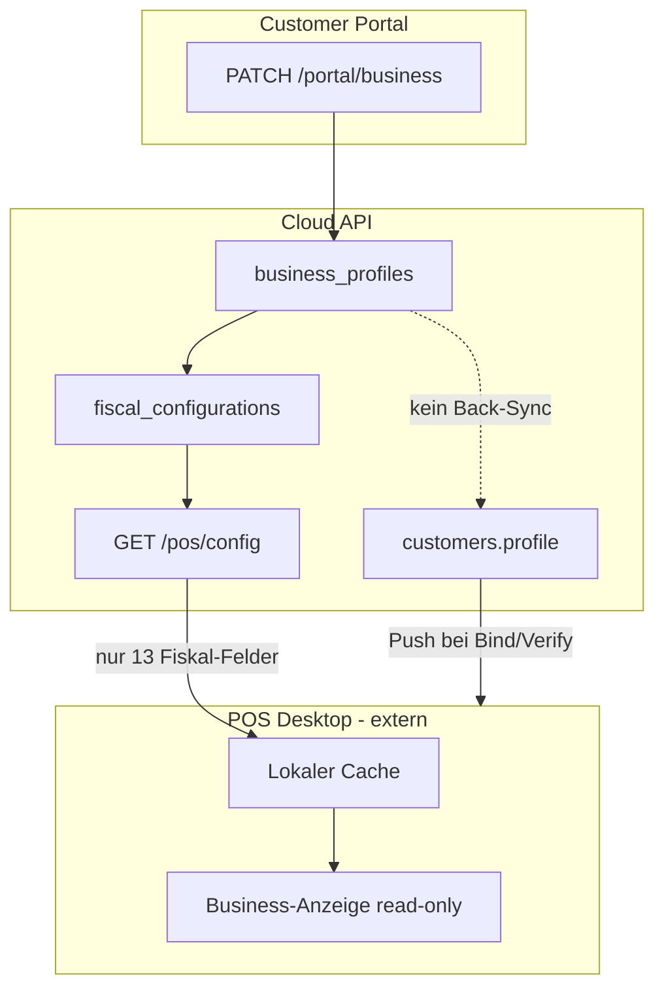

# Analyse: Cloud Phase Sync — Business / Profile / Fiscal → POS Desktop

**Stand:** 2026-07-03  
**Scope:** Nur Analyse und Umsetzungsplan — keine Code-Änderungen in diesem Schritt.  
**Repo:** `caisty` (Cloud API, Portal, Admin); **POS Desktop-Quellcode liegt außerhalb dieses Repos.**

---

## Executive Summary

Das **Customer Portal** schreibt Business-Daten korrekt in `business_profiles` und leitet Fiskal-Regeln aus `country_config` ab. **Cloud Admin** liest Fiskal/Land/Währung aus derselben Pipeline (`business_profiles` → `fiscal_configurations`), zeigt Firmendaten im Kunden-Detail aber noch aus dem **Legacy-Speicher** `customers.profile` (POS-Push). **POS Desktop** kann Portal-Änderungen an Firma, Adresse, Steuerdaten und Sprache **nicht** übernehmen, weil `GET /pos/config` nur `SafePosFiscalConfig` (13 Fiskal-Felder) liefert und Endpoints wie `/pos/business-profile` / `/pos/fiscal-config` **nicht existieren**. Zusätzlich gibt es **kein `config_version`** — nur `business_profiles.updated_at` und `fiscal_configurations.updated_at` / `last_sync_at`.

**Kernproblem:** Zwei parallele „Business“-Quellen (`business_profiles` vs. `customers.profile`) und ein unvollständiger POS-Pull-Contract.

---

## 1. Aktuelle Datenquellen

### 1.1 Customer Portal → Source of Truth (Zielbild)

| Schicht | Speicher | API |
|---------|----------|-----|
| Portal schreibt | `business_profiles` (+ `orgs.name` bei `companyName`) | `PATCH /portal/business` |
| Portal liest | `business_profiles` + abgeleitete Fiskal-Snapshot | `GET /portal/business` |
| Fiskal-Snapshot | `fiscal_configurations` (Cache/Denormalisierung) | intern via `syncFiscalConfigurationForOrg()` |
| Länderregeln | `country_config` (DB, gecacht) | `GET /country-config` (öffentlich) |

**Gespeicherte Felder (Portal PATCH):**

| UI-Feld | API-Feld | DB-Spalte / JSON |
|---------|----------|------------------|
| Firmenname | `companyName` | `company_name` |
| Rechtlicher Name | `legalName` | `legal_name` |
| Land | `country` | `country` |
| Währung | `currency` | `currency` |
| Standardsprache | `defaultLanguage` | `default_language` |
| Straße | `businessAddress.street` | `business_address_json.street` |
| Stadt | `businessAddress.city` | `business_address_json.city` |
| PLZ | `businessAddress.zip` | `business_address_json.zip` *(im Code `zip`, nicht `postalCode`)* |
| USt-IdNr. | `vatId` | `vat_id` |
| Steuernummer | `taxId` | `tax_id` |

**Nicht vom Portal editierbar** (serverseitig abgeleitet): `fiscalStatus`, `fiscalProvider`, `fiscalEnvironment`, `complianceStatus`, `posConfigurationStatus`, `receiptMode`, `fiscalRequired`, `providerLabel`, `fiscalNotice`, …

**Frontend:** `apps/caisty-site/src/routes/PortalBusinessPage.tsx`  
**API-Client:** `apps/caisty-site/src/lib/portalApi.ts` → `updatePortalBusiness()`  
**Backend:** `apps/cloud-api/src/routes/portal-business.ts`

### 1.2 Legacy: POS-Push → `customers.profile`

| Richtung | Endpoint | Speicher |
|----------|----------|----------|
| POS → Cloud | `POST /licenses/verify`, `POST /devices/bind` mit `cloudCustomer` | `customers.profile` (JSON) |

**`cloudCustomer`-Felder:** `accountName`, `legalName`, `externalId`, `contact`, `address`, `language`, `notes`, `lastSyncAt` — **kein** `vatId` / `taxId`.

**Backend:** `apps/cloud-api/src/routes/public-license.ts` → `upsertCustomerProfileFromPos()`

Beim **ersten** `GET /portal/business` wird `business_profiles` aus `customers.profile` **einmalig** befüllt (`profileFromCustomerJson`). Ein Portal-`PATCH` schreibt **nicht zurück** nach `customers.profile`.

### 1.3 Cloud Admin

| Seite | Business-Quelle | Endpoint(s) |
|-------|-----------------|-------------|
| Customer Detail — „Business / Fiscal“ | `business_profiles` → Fiskal-Snapshot | `GET /admin/fiscal/customers/:id` |
| Customer Detail — „Account & Store (POS)“ | `customers.profile` (Legacy) | `GET /customers/:id` |
| Fiscal Compliance Dashboard | `business_profiles` + `fiscal_configurations` | `GET /admin/fiscal/overview` |
| Lizenzen / Geräte | `licenses`, `devices` (org-bezogen) | `GET /licenses`, `GET /devices` |

**Fazit Admin:** Fiskal einheitlich aus `business_profiles`-Pipeline; **Firmenidentität im Admin-Detail kann von Portal abweichen**, solange `customers.profile` nicht synchronisiert wird.

### 1.4 POS Desktop (außerhalb Repo)

Erwartetes Verhalten laut API-Docs (`docs/api-handshake.md`):

- **Pull:** `GET /pos/config?deviceId=&licenseKey=` → nur Fiskal-Config
- **Push:** Bind/Verify mit optionalem `cloudCustomer`
- **Heartbeat:** `POST /devices/heartbeat` → nur Geräte-Liveness, **kein** Business-Refresh

Ob POS 0.3.x den Sync-Button an `GET /pos/config` bindet und lokalen Cache überschreibt, ist **im Repo nicht verifizierbar**.

---

## 2. Aktuelle Endpoints

### 2.1 Portal

| Methode | Pfad | Zweck |
|---------|------|-------|
| `GET` | `/portal/business` | Profil lesen / auto-anlegen, Fiskal sync |
| `PATCH` | `/portal/business` | Profil speichern |
| `GET` | `/portal/business/pos-config` | `SafePosFiscalConfig` (Vorschau; im Portal-UI aktuell **unbenutzt**) |

### 2.2 Admin

| Methode | Pfad | Zweck |
|---------|------|-------|
| `GET` | `/admin/fiscal/overview` | Alle Orgs mit Fiskal-Übersicht |
| `GET` | `/admin/fiscal/customers/:customerId` | Fiskal-Snapshot pro Kunde |
| `GET` | `/customers/:id` | Kunde inkl. Legacy-`profile` |
| `GET` | `/country-config` | Länderregeln (auch Admin-UI) |

### 2.3 POS (öffentlich, device-scoped)

| Methode | Pfad | Status | Response |
|---------|------|--------|----------|
| `GET` | `/pos/config` | **Implementiert** | `{ ok, config: SafePosFiscalConfig }` |
| `GET` | `/pos/business-profile` | **Nicht vorhanden** | — |
| `GET` | `/pos/fiscal-config` | **Nicht vorhanden** | (Fiskal steckt in `/pos/config`) |
| `POST` | `/licenses/verify` | Implementiert | optional `cloudCustomer` → `customers.profile` |
| `POST` | `/devices/bind` | Implementiert | optional `cloudCustomer` → `customers.profile` |
| `POST` | `/devices/heartbeat` | Implementiert | kein Config-Payload |

**Implementierung POS-Config:** `apps/cloud-api/src/routes/pos-config.ts`  
**Contract-Typ:** `SafePosFiscalConfig` in `apps/cloud-api/src/fiscal/types.ts`

### 2.4 `SafePosFiscalConfig` (aktueller POS-Pull)

Enthalten:

- `country`, `currency`
- `fiscalRequired`, `providerKey`, `providerLabel`, `providerType`
- `fiscalStatus` (customer-facing, z. B. `pending_setup`)
- `receiptMode`, `fiscalConfigurationLabel`
- `posDownloadAllowed`, `fiscalNotice`, `supportedExports`, `mode`

**Nicht enthalten:**

- `companyName`, `legalName`, `businessAddress`, `vatId`, `taxId`, `defaultLanguage`
- `complianceStatus`, `posConfigurationStatus`
- `updatedAt`, `configVersion`

---

## 3. Fehlende Felder & Lücken

### 3.1 Portal → POS (Pull)

| Feld | Portal speichert | POS `GET /pos/config` | POS Push `cloudCustomer` |
|------|------------------|----------------------|--------------------------|
| companyName | ✓ | ✗ | als `accountName` |
| legalName | ✓ | ✗ | ✓ |
| country | ✓ | ✓ | nur in `address.country` |
| currency | ✓ | ✓ | ✗ |
| defaultLanguage | ✓ | ✗ | als `language` |
| street / city / zip | ✓ | ✗ | in `address` |
| vatId / taxId | ✓ | ✗ | ✗ |
| fiscalRequired / receiptMode / provider | abgeleitet | ✓ | ✗ |
| complianceStatus | abgeleitet | ✗ | ✗ |

### 3.2 Versionierung / Cache-Invalidierung

| Mechanismus | Vorhanden? | Verhalten |
|-------------|------------|-----------|
| `business_profiles.updated_at` | ✓ | wird bei jedem `PATCH /portal/business` gesetzt |
| `fiscal_configurations.updated_at` | ✓ | bei `syncFiscalConfigurationForOrg()` |
| `fiscal_configurations.last_sync_at` | ✓ | bei Fiskal-Sync |
| `config_version` | **✗** | existiert nirgends im Repo |
| POS-Response mit Timestamp/ETag | **✗** | POS kann Änderungen nicht erkennen ohne Vollvergleich |

### 3.3 Admin vs. Portal

Admin-Fiskal-API liefert **keine** Portal-Felder `companyName`, `legalName`, `vatId`, `taxId`, `businessAddress` aus `business_profiles`. Diese sind nur über Portal sichtbar/editierbar.

---

## 4. Warum POS Änderungen nicht sieht



**Hauptursachen (priorisiert):**

1. **Unvollständiger Pull-Contract:** Portal-Änderungen an Firma/Adresse/Steuer/Sprache werden von `GET /pos/config` nicht geliefert.
2. **Fehlender Business-Endpoint:** `/pos/business-profile` existiert nicht; POS kann keine dedizierte Business-Payload ziehen.
3. **Dual Store:** Admin/POS-Legacy zeigen noch `customers.profile`; Portal schreibt nur `business_profiles` → sichtbare Divergenz in Admin und ggf. POS (wenn POS lokal aus Push-Daten rendert).
4. **Keine Versionsmarke für POS:** Ohne `configVersion` / `updatedAt` im POS-Response kein zuverlässiger „stale cache“-Trigger.
5. **Heartbeat ohne Config:** Kein Hintergrund-Sync; Änderungen kommen nur an, wenn POS explizit `GET /pos/config` aufruft — und selbst dann nur Fiskal-Felder.
6. **POS-Quellcode extern:** Ob Sync-Button, Cache-Update und UI-Binding korrekt implementiert sind, kann hier nicht geprüft werden.

---

## 5. Soll-Datenmodell

### 5.1 Rollen

| Rolle | Verantwortung |
|-------|----------------|
| **Customer Portal** | Einzige Schreibquelle für Business-Profil (Firma, Adresse, Steuer, Land, Währung, Sprache) |
| **Cloud API** | Validierung, `country_config`-Regeln, Fiskal-Ableitung, Versionierung |
| **Cloud Admin** | Lesen derselben `business_profiles`-Daten + Fiskal-Ops; kein zweites Profil |
| **POS Desktop** | Read-only Client; lokaler Cache; Pull bei Start / manuell / später automatisch |

### 5.2 Einheitliches Cloud-Objekt (logisch)

Empfohlenes zusammengeführtes DTO für POS-Pull (Name z. B. `PosBusinessConfig`):

```ts
{
  // Identität
  companyName: string;
  legalName: string;
  businessAddress: { street, city, zip, country };
  vatId: string | null;
  taxId: string | null;
  defaultLanguage: "en" | "de" | "fr" | "ar";

  // Regional
  country: string | null;
  currency: string;

  // Fiskal (bestehend SafePosFiscalConfig)
  fiscalRequired: boolean;
  providerKey, providerLabel, providerType, fiscalStatus, receiptMode, ...;

  // Meta
  complianceStatus: "incomplete" | "ready" | "action_required";
  posConfigurationStatus: "not_ready" | "ready";
  updatedAt: string;          // ISO aus business_profiles
  configVersion: number;      // monoton steigend bei jeder relevanten Änderung
}
```

**Alternative (rückwärtskompatibel):** `GET /pos/config` um Business-Block erweitern **oder** neuer `GET /pos/business-profile` mit gleicher Auth wie `/pos/config`.

### 5.3 Legacy `customers.profile`

**Soll:** Deprecaten als Schreibquelle für Business-Daten. Optional:

- Portal-PATCH spiegelt relevante Felder nach `customers.profile` (Übergang), **oder**
- Admin/POS lesen nur noch `business_profiles` und `customers.profile` wird read-only Archiv.

### 5.4 Sync-Modell POS

| Trigger | Soll |
|---------|------|
| Manuell (Button) | Pull `configVersion` / `updatedAt` vergleichen → Voll- oder Delta-Update |
| App-Start | Gleicher Pull |
| Später automatisch | Heartbeat-Response mit `configVersion` Hint oder periodischer Pull |

---

## 6. Country → Currency → Fiscal-Regeln

### 6.1 Zentrale Konfiguration

**Tabelle:** `country_config`  
**Migration/Seed:** `apps/cloud-api/drizzle/019_country_config.sql`  
**Service:** `apps/cloud-api/src/countryConfig/CountryConfigService.ts`  
**Ableitung Fiskal:** `buildFiscalConfiguration.ts` + `deriveFiscalFromCountryConfig.ts`  
**Dokumentation:** `docs/country-config.md`

### 6.2 Referenzwerte (Seed)

| Land | Währung | `fiscal_required` | `fiscal_provider` | `receipt_mode` |
|------|---------|-------------------|-------------------|----------------|
| **DE** | EUR | `true` | `fiskaly` | `certified` |
| **TN** | TND | `false` | `NULL` | `standard` |

Weitere Länder: EU-Märkte oft `fiscal_required=true` + `coming_soon`; CH/GB/US ohne Pflicht-Fiskal.

### 6.3 Country → Currency (Portal)

| Mechanismus | Verhalten |
|-------------|-----------|
| Frontend | Bei Länderwechsel: `setCurrency(opt.currency)` aus `GET /country-config` |
| Backend PATCH | `defaultCurrencyForCountry()` wenn Land wechselt und `currency` fehlt |
| Validierung | `isCurrencyAllowedForCountry()` gegen `allowed_currencies_json` |
| DE → EUR, TN → TND | ✓ im Seed und in `CountryConfigService` |

**Dateien:**  
`apps/caisty-site/src/config/businessCountries.ts`, `countryConfigClient.ts`  
`apps/cloud-api/src/lib/businessProfileRules.ts`

### 6.4 Portal Dashboard — Fiskal-Anzeige

**Logik:** `useFiscalVisibility` — `showFiscalUi` nur wenn `fiscalRequired === true`  
**Datei:** `apps/caisty-site/src/lib/useFiscalVisibility.ts`

| Land | `fiscalRequired` | Dashboard |
|------|------------------|-----------|
| TN | `false` | Kein Fiskal-Hinweis (grüne Zeile ausgeblendet) |
| DE | `true` | Fiskal-Hinweis (`getFiscalCustomerCopy`: Auto-Setup oder Active) |

Stepper Setup (Phase III) nutzt `complianceStatus`, Land/Währung, Lizenz, Geräte — unabhängig von Fiskal-UI für TN.

### 6.5 Compliance-Ableitung (Backend)

`computeComplianceStatus()` (`businessProfileRules.ts`):

- `incomplete` — fehlendes Land, `companyName`, `legalName` oder Adresse (street+city+zip)
- `action_required` — u. a. `fiscalStatus` ∈ `error`, `pending_setup`, `required`
- `ready` — sonst

**Hinweis DE:** Auch mit vollständigem Formular kann `complianceStatus = action_required` bleiben, solange Fiskal `pending_setup` ist — Stepper Schritt 2 („Firmendaten“) ist trotzdem `ready`, wenn nur `complianceStatus === "ready"` zählt (aktuell Stepper-Logik).

---

## 7. Umsetzung in Phasen

### Phase A — Contract & API (Cloud)

1. **`config_version`** auf `business_profiles` (Integer, Default 0, +1 bei jedem PATCH) **oder** monotoner Hash; `updatedAt` zusätzlich in POS-Response.
2. **POS Business-Pull:** Entweder
   - **A1:** `GET /pos/business-profile` (neu, gleiche Auth wie `/pos/config`), **oder**
   - **A2:** `GET /pos/config` um Business-Block erweitern (Breaking-Risk für POS 0.3.x prüfen).
3. **`toSafePosBusinessConfig()`** aus `business_profiles` + bestehendem Fiskal-Snapshot bauen.
4. **Portal-PATCH → optional** `customers.profile` spiegeln (Übergang Admin/POS-Legacy).
5. **Admin:** `GET /admin/fiscal/customers/:id` oder neues `GET /admin/customers/:id/business` um `companyName`, Adresse, Steuern aus `business_profiles` erweitern.

### Phase B — Admin-Konsolidierung

1. Customer Detail: „Account & Store“ aus `business_profiles` statt `customers.profile` (mit Fallback für alte Kunden).
2. Fiscal Dashboard: bereits konsistent — nur Dokumentation/Labels.
3. Entfernen doppelter Business-Quelle in UI (ein Block „Business“, ein Block „Fiscal“).

### Phase C — POS Desktop (externes Repo)

1. Sync-Button / Start: Pull neuer Endpoint(s), `configVersion` vergleichen.
2. Lokaler Cache atomar ersetzen (Country, Currency, Fiscal, Firmenname, Adresse, Steuer).
3. Business-UI strikt read-only; keine lokalen PATCH mehr an Cloud-Business.
4. Receipt-Engine: `receiptMode` + `currency` aus Cloud-Cache.
5. Deprecate Push von `cloudCustomer` für Felder, die Portal pflegt (oder nur noch Kontakt/Notes).

### Phase D — Automatischer Sync (später)

1. `POST /devices/heartbeat` Response: `{ configVersion, businessUpdatedAt }` als Hint.
2. POS: bei Version-Delta Background-Pull.
3. Optional: WebSocket / SSE (nicht nötig für MVP).

---

## 8. Betroffene Dateien

### Cloud API

| Datei | Änderungstyp |
|-------|----------------|
| `src/routes/pos-config.ts` | Response erweitern oder Business-Route |
| `src/routes/portal-business.ts` | `config_version` bump, ggf. profile mirror |
| `src/routes/admin/fiscal.ts` | Business-Felder in Admin-DTO |
| `src/routes/public-license.ts` | Push-Strategie / Deprecation |
| `src/fiscal/buildFiscalConfiguration.ts` | ggf. kombiniertes POS-DTO |
| `src/fiscal/types.ts` | `PosBusinessConfig`, Version-Felder |
| `src/fiscal/fiscalConfigurationService.ts` | Sync-Metadaten |
| `src/db/schema/businessProfiles.ts` | `config_version` Spalte |
| `drizzle/0xx_*.sql` | Migration `config_version` |
| `src/lib/businessProfileRules.ts` | unverändert oder Compliance-Feintuning |

### Customer Portal

| Datei | Änderungstyp |
|-------|----------------|
| `src/routes/PortalBusinessPage.tsx` | ggf. Anzeige `updatedAt` / Sync-Hinweis |
| `src/routes/PortalDashboard.tsx` | bereits country-abhängige Fiskal-UI |
| `src/lib/portalApi.ts` | neue Typen wenn API erweitert |

### Cloud Admin

| Datei | Änderungstyp |
|-------|----------------|
| `src/pages/Customers/CustomerDetailPage.tsx` | eine Business-Quelle |
| `src/lib/fiscalApi.ts` | erweiterte DTOs |

### Dokumentation

| Datei | Änderungstyp |
|-------|----------------|
| `docs/api-handshake.md` | POS-Contract Business-Sync |
| `docs/country-config.md` | ggf. Cross-Links |

### POS Desktop (extern)

- Sync-Service, lokaler Store, Business-Settings-Screen, Receipt-Config — **nicht in diesem Repo**.

---

## 9. Risiken

| Risiko | Auswirkung | Mitigation |
|--------|------------|------------|
| Breaking Change an `GET /pos/config` | POS 0.3.x bricht | Neuer Endpoint oder versioniertes `Accept`/Schema; Contract-Tests |
| Zwei Profile-Stores | Admin/POS zeigen alte Daten | Übergangs-Spiegelung + Migrations-Script `customers.profile` → `business_profiles` |
| Fehlendes `business_profiles` bei POS-Pull | `404 business_profile_missing` | Portal-Onboarding erzwingen; POS-Fehlermeldung mit Link zum Portal |
| DE `pending_setup` vs. `complianceStatus` | Stepper vs. Fiskal-Status verwirrend | UX-Regeln dokumentieren; Stepper und Compliance entkoppeln (bereits teilweise so) |
| POS-Repo nicht synchron | Cloud fertig, Desktop nicht | Gemeinsamer Contract-Test + Release-Checkliste |
| Kein `config_version` | Stale Cache | Phase A priorisieren |
| Heartbeat-Last | Auto-Sync zu aggressiv | Nur Version-Hint, Pull on demand |

---

## 10. Offene Fragen

1. **Endpoint-Design:** Ein kombinierter `GET /pos/config` vs. getrennt `/pos/business-profile` + `/pos/fiscal-config` — was bevorzugt POS 0.3.x / 0.4.x?
2. **Breaking Compatibility:** Darf `GET /pos/config` neue Felder additive liefern, oder braucht POS ein explizites Schema-Version-Feld?
3. **`customers.profile`:** Komplett deprecaten oder spiegeln? Wer ist Owner für `contact` / `notes` / `externalId`?
4. **POS Push:** Soll `cloudCustomer` bei Bind/Verify künftig ignoriert werden, wenn `business_profiles` existiert?
5. **Steuer auf Belegen:** Braucht POS `vatId`/`taxId` im Pull für Receipt-Header — welche Felder sind POS-pflichtig?
6. **Admin-Bearbeitung:** Soll Admin Business jemals schreiben dürfen, oder strikt Portal-only?
7. **Auto-Sync:** Reicht Heartbeat-Hint, oder festes Intervall (z. B. 15 min)?
8. **POS-Repo-Zugang:** Wo liegt der Desktop-Code für Implementierung Phase C und Verifikation des Sync-Buttons?
9. **`complianceStatus` für DE:** Soll Stepper „Firmendaten erledigt“ auch bei `action_required` (Fiskal pending) grün sein — oder Fiskal als eigener Schritt?
10. **Migration Bestand:** Einmaliges Backfill `business_profiles` aus `customers.profile` für alle Orgs ohne Portal-Besuch?

---

## Anhang: Verifikations-Checkliste (manuell)

- [ ] Portal: DE speichern → `currency=EUR`; TN → `TND` (Network-Tab `PATCH /portal/business`)
- [ ] DB: `business_profiles.updated_at` ändert sich; `config_version` fehlt noch
- [ ] Admin Fiscal: Land/Währung nach Portal-Save aktualisiert (nach Reload)
- [ ] Admin Customer Detail: prüfen ob „POS Account“ noch alte Werte zeigt
- [ ] `GET /pos/config` mit gebundenem Gerät: enthält **keine** `companyName`
- [ ] POS Desktop: nach Portal-Änderung manueller Sync — Verhalten dokumentieren (extern)

---

*Erstellt als Analysegrundlage für „Cloud Phase Sync“. Bezug: `docs/api-handshake.md`, `docs/country-config.md`, `docs/ANALYSE-FISKAL-UMBAU.md`.*
