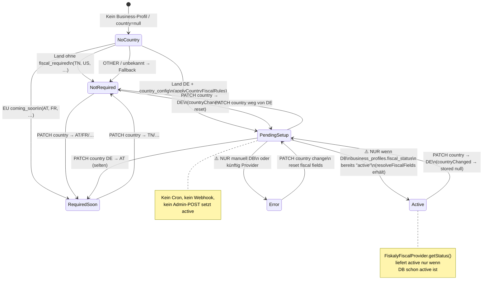
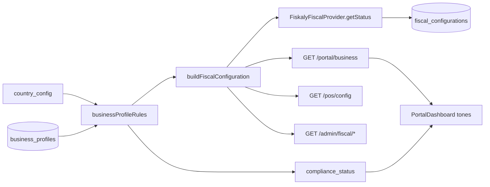
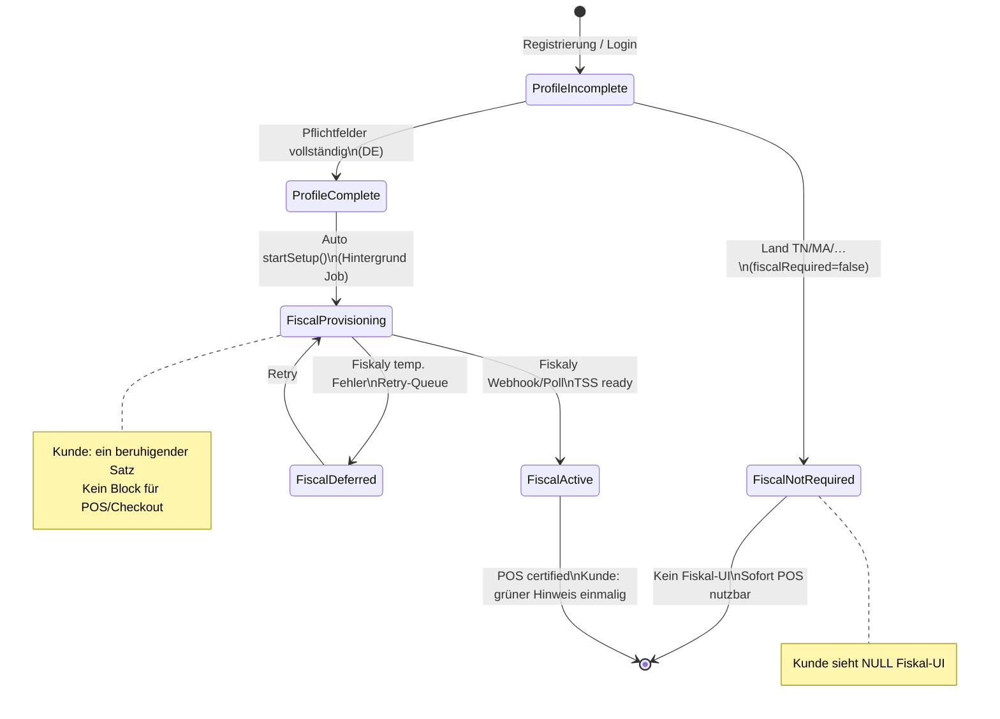

# Analyse: Fiskalisierungs-Prozess — Portal, Admin, POS

**Stand:** 03.07.2026  
**Umgebung:** Staging (Code-Analyse, keine API-Calls, keine Migrationen)  
**Grundlage:** Phase 1 `country_config` abgeschlossen (`docs/country-config.md`, `docs/ANALYSE-FISKAL-UMBAU.md`)

---

## 1. Executive Summary

Der Fiskalisierungs-Prozess ist **architektonisch vorbereitet**, aber **operativ noch nicht implementiert**: `FiskalyFiscalProvider` ist ein Platzhalter ohne echte API-Calls, Admin-Aktionen („Start setup“, „Mark active“) sind **UI-only und dauerhaft deaktiviert**, und es existiert **kein serverseitiger Pfad**, der `fiscal_status` auf `active` setzt (außer manuellem DB-Eingriff + `resolveFiscalFields`-Erhalt).

**Automatische Übergänge heute:** Land wählen/speichern → `pending_setup` (DE) bzw. `not_required` / `required_coming_soon` (EU soon) — rein regelbasiert aus `country_config` + `businessProfileRules.ts`. Jeder Business-GET/PATCH triggert `syncFiscalConfigurationForOrg()` → Snapshot in `fiscal_configurations`.

**Kundenportal:** Zeigt Fiskal-Inhalte **flächendeckend** (eigene Dashboard-Karte, Compliance-/POS-Readiness, Fiskaly-Texte) — **ohne** `fiscalRequired`-Gating, obwohl die API das Feld liefert (`portal-business.ts` Z. 109).

**Admin:** Fiscal/Compliance-Seite listet **echte** abgeleitete Daten (Join `business_profiles` ↔ `customers`), KPIs aus `fiscalOverviewSummary.ts` — Aktionen sind Platzhalter (`markActive: false`, Buttons `disabled`).

**POS:** `GET /pos/config` liefert bei DE `fiscalStatus: pending_setup`, `receiptMode: certified`, `posDownloadAllowed: true` — **kein API-Block** für Download/Bindung. Ob Desktop-POS intern blockiert, liegt **außerhalb dieses Repos**.

**Größte Lücke:** Kein End-to-End-Fiskaly-Onboarding (Organisation/TSS/Keys/Webhooks) → Kunden sehen „pending“ ohne dass sich der Status jemals automatisch ändert.

---

## 2. Zustandsmaschine (Ist)

### 2.1 Status-Vokabular (Code + DB)

| Ebene | Feld | Werte (Ist) | Datei |
|-------|------|-------------|-------|
| **Intern** (`business_profiles.fiscal_status`, `fiscal_configurations.fiscal_status`) | `FiscalStatusInternal` | `not_required`, `required`, `required_soon`, `pending_setup`, `active`, `error` | `businessProfileRules.ts` Z. 42–48 |
| **Kunden-facing** (Portal-API `business.fiscalStatus`) | `fiscalStatusCustomer` | wie oben, aber `required_soon` → `required_coming_soon` | `customerFacingFiscalStatus()` Z. 284–303 |
| **Compliance** | `compliance_status` | `incomplete`, `ready`, `action_required` | `computeComplianceStatus()` Z. 201–232 |
| **POS-Readiness (intern)** | `pos_configuration_status` | `not_ready`, `ready` | `computePosConfigurationStatus()` Z. 234–259 |
| **Provider-Umgebung** | `fiscal_environment` | `not_configured`, `sandbox`, `live` | Schema `businessProfiles.ts` Z. 39 — **nie gesetzt außer Default** |
| **country_config.status** | Meta | `active`, `coming_soon` | `country_config` Tabelle |

Zusätzlich (kein Fiskal-Lifecycle, aber Dashboard-relevant): `portal_status`, License-Status, Device-Count.

### 2.2 Mermaid — Ist-Zustandsmaschine (Fiskal-Status intern)



### 2.3 Trigger-Tabelle

| Übergang | Auslöser | Auto/Manuell | Datei(en) |
|----------|----------|-------------|-----------|
| → `pending_setup` (DE) | Erstes Anlegen Business-Profil mit `country=DE` | **Auto** | `portal-business.ts` `getOrCreateBusinessProfile()` Z. 230–262 |
| → `pending_setup` (DE) | `PATCH /portal/business` setzt/changed `country=DE` | **Auto** | `portal-business.ts` Z. 388–395 |
| → `required_soon` (EU soon) | Land AT/FR/… per country_config | **Auto** | `deriveFiscalFromCountryConfig.ts` Z. 14–16 |
| → `not_required` | Nicht-Fiskal-Länder | **Auto** | `initialFiscalStatusFromConfig()` |
| → `compliance action_required` | DE + `pending_setup` + Profil sonst vollständig | **Auto** | `computeComplianceStatus()` Z. 224–228 |
| → `pos_configuration not_ready` | DE + pending + compliance nicht incomplete | **Auto** | `computePosConfigurationStatus()` Z. 248–255 |
| → `fiscal_configurations` Sync | Jeder GET/PATCH `/portal/business`, Admin-Overview, `/pos/config` | **Auto** | `fiscalConfigurationService.ts` `syncFiscalConfigurationForOrg()` |
| → `active` | — | **Manuell (DB)** | Kein API-Endpoint; nur `resolveFiscalFields()` erhält `storedStatus===active` Z. 159–170 |
| Fiskaly `startSetup()` | — | **Nicht implementiert** | `FiskalyFiscalProvider.ts` Z. 42–44 wirft Error |
| Admin „Mark active“ | Button disabled | **Nicht implementiert** | `CustomerDetailPage.tsx` Z. 638–645; `actions.markActive: false` in `admin/fiscal.ts` Z. 35 |

**Kein Cron, kein Queue-Worker, kein Fiskaly-Webhook** im Repo (Grep: keine `FISKALY_*` env vars in `env.ts` / `.env.example`).

---

## 3. Fiskaly-Integrationsstand

### 3.1 Implementiert / Gemockt / Fehlt

| Komponente | Stand | Pfad |
|------------|-------|------|
| Provider-Interface | ✅ Definiert | `fiscal/providers/FiscalProvider.ts` |
| Factory | ✅ `none` + `fiskaly` | `FiscalProviderFactory.ts` |
| **Fiskaly getStatus()** | 🟡 **Mock** — statische Messages | `FiskalyFiscalProvider.ts` Z. 15–39 |
| **Fiskaly startSetup()** | ❌ `throw new Error("…not implemented")` | Z. 42–44 |
| Organisation anlegen | ❌ Fehlt | — |
| TSS / Client / API-Keys | ❌ Fehlt | — |
| Signatur / Receipt Signing | ❌ Fehlt | — |
| Webhooks Fiskaly → Cloud | ❌ Fehlt | — |
| Retry / Idempotency Fiskaly | ❌ Fehlt | — |
| `fiscal_environment` sandbox/live | ❌ Immer `not_configured` | `initialFiscalEnvironmentFromConfig()` |
| Secrets / Credentials | ❌ Keine Env-Vars | `config/env.ts`, `.env.example` — **kein FISKALY_*** |
| enrichWithProviderStatus | ✅ Ruft Provider auf, **ändert aber DB nicht** | `buildFiscalConfiguration.ts` Z. 188–210 |

### 3.2 Bedeutung des Portal-Texts

Text in `FiskalyFiscalProvider.getStatus()` (Z. 36–37):

> *"Cloud fiscal setup is pending. POS will use certified mode once Caisty completes API onboarding."*

**Konkret im Code:**
- Wird bei jedem `syncFiscalConfigurationForOrg()` für DE-Orgs in den Snapshot geschrieben (`fiscalNotice` / Provider-Message).
- „Caisty completes API onboarding“ = **zukünftige Implementierung von `startSetup()`** + Persistenz — **existiert nicht**.
- POS erhält parallel `receiptMode: certified` und `fiscalStatus: pending_setup` via `toSafePosFiscalConfig()` — **Widerspruch zwischen Modus und Status** (siehe Abschnitt 5).

### 3.3 Staging vs. Production

Keine getrennte Fiskaly-Konfiguration im Code. `fiscal_environment` ist schema-seitig vorgesehen (`not_configured` | `sandbox` | `live`), wird aber nirgends befüllt.

### 3.4 Datenbedarf Fiskaly (aus Code abgeleitet + Annahme)

**Im Code erfasst** (`portal-business.ts`, Business-Formular):

| Feld | Pflicht für Compliance `ready` | Für Fiskaly (Annahme) |
|------|-------------------------------|------------------------|
| `companyName` | ✅ Ja | Sehr wahrscheinlich ja |
| `legalName` | ✅ Ja | Sehr wahrscheinlich ja |
| Adresse street/city/zip | ✅ Ja | Sehr wahrscheinlich ja (DE TSE) |
| `country` | ✅ Ja | Ja |
| `vatId` | ❌ Optional im Code | **Vermutlich** für DE Pflicht ( nicht validiert) |
| `taxId` | ❌ Optional | Optional |

**Fazit:** Wizard-Pflichtfelder sollten mindestens Compliance-Pflicht + `vatId` für DE sein — **USt-ID wird heute nicht erzwungen**, obwohl sie für echtes Fiskaly-Onboarding üblich ist.

---

## 4. Admin: Fiscal/Compliance im Detail

### 4.1 Endpoints (nur GET)

| Endpoint | Wirkung | Datei |
|----------|---------|-------|
| `GET /admin/fiscal/overview` | Join aller Business-Profile, pro Row `syncFiscalConfigurationForOrg()`, KPI-Summary | `admin/fiscal.ts` Z. 43–55 |
| `GET /admin/fiscal/customers/:id` | Fiscal-Snapshot für einen Kunden | Z. 58–102 |

**Kein POST/PATCH/DELETE** für Fiskal-Aktionen.

### 4.2 UI-Aktionen vs. Server

| UI-Aktion | Seite | Serverseitig | Effekt |
|-----------|-------|--------------|--------|
| **Start setup** | `FiscalCompliancePage.tsx` Z. 541 | ❌ `DisabledAction` | Keiner — Tooltip: `FISCAL_ACTION_TOOLTIP` |
| **Mark active** | Z. 542 | ❌ disabled | Keiner — `markActive: false` in API |
| **Mark pending** | Z. 543 | ❌ disabled | Keiner |
| **View logs** | Z. 543 | ❌ disabled | Keiner |
| **View customer** | Link zu Customer Detail | ✅ Navigation only | — |
| Filter/Suche/Sort | Z. 360–442 | Client-side | — |

`FISCAL_ACTION_TOOLTIP` (`caistyTerminology.ts` Z. 131–132): *"Available after Fiskaly onboarding is completed."*

**Risiko „Mark active“:** Derzeit **nicht ausnutzbar** — Button disabled. Wäre er aktiv, gäbe es **keinen Endpoint**; hypothetisch nur DB-Flag ohne Fiskaly-Prüfung → POS würde `active` + `certified` anzeigen ohne echte TSS.

### 4.3 KPI-Kacheln (`fiscalOverviewSummary.ts`)

| KPI | Berechnung | Echte Daten? |
|-----|------------|--------------|
| `totalProfiles` | `items.length` | ✅ |
| `germanyFiskalyPending` | `country===DE` && `provider===fiskaly` && **intern** `fiscalStatus!==active` | ✅ (zählt praktisch alle DE-Kunden) |
| `activeSetups` | intern `fiscalStatus===active` | ✅ — aber **fast immer 0** ohne DB-Manipulation |
| `comingSoonCountries` | `providerType===coming_soon` | ✅ |
| `standardReceiptMode` | `providerType===none` && not_required / Standard-Label | ✅ |

**Hinweis:** Summary nutzt **internen** `fiscalStatus` aus Snapshot (`computeFiscalOverviewSummary(rows)` vor Mapping), Tabelle zeigt **kunden-facing** `fiscalStatus` (`mapFiscalOverviewItem` Z. 25).

### 4.4 country_config-basierte Metrik (Vorschlag)

Statt `country === "DE"` (`fiscalOverviewSummary.ts` Z. 17–20):

```typescript
// Ziel: fiscalRequired && provider==='fiskaly' && fiscalStatus!=='active'
row.fiscalRequired && row.provider === "fiskaly" && row.fiscalStatus !== "active"
```

Damit wäre DE und künftige Fiskal-Länder abgedeckt, ohne Hardcode.

### 4.5 Lücke zur Ziel-Admin-Ansicht

| Ziel | Ist | Aufwand |
|------|-----|---------|
| Gruppierung fiscal_required ja/nein | Flache Tabelle + Filter | **M** — Tabs + `fiscalRequired` Filter |
| Ampel grün/gelb/rot | Badge-Klassen pro Status, keine Ampel-Logik | **S** — Mapping `fiscalStatus` → Ampel |
| Aufklappbare Detailzeile | ❌ | **M** — Row-Expand, Daten schon in API |
| Aktionen nur wo nötig | Buttons disabled | **L** — braucht Backend |

**Wiederverwendbar:** `SummaryCard`, `fiscalStatusBadgeClass`, `formatFiscalStatus`, `fetchFiscalOverview`, Tabellen-Styling `admin-card`.

---

## 5. Kundenportal: Fiskal-Sichtbarkeit

### 5.1 Vollständige Liste UI-Stellen

| # | Ort | Datei / Komponente | Inhalt | Empfehlung | Textvorschlag (DE / EN) |
|---|-----|-------------------|--------|------------|-------------------------|
| 1 | Dashboard Subtitle | `translations/portal/en.ts` Z. 72–73 | „…Fiscal settings synced…" | **(c)** Umformulieren | DE: *„Dein Konto, dein Geschäft und deine Kassen — zentral in Caisty Cloud."* / EN: *"Your account, business, and tills — centrally in Caisty Cloud."* |
| 2 | Cloud-Overview Hint | `en.ts` Z. 75–76 | „Same terminology as POS Admin" | **(a)** Entfernen für Kunden | — |
| 3 | Karte **Fiscal** (5-Spalten-Grid) | `PortalDashboard.tsx` Z. 265–274 | Eigene Karte + Tone-Badge | **(b)** Nur wenn `fiscalRequired` | — |
| 4 | Fiscal-Karte Detail „Fiskaly pending" | `PortalDashboard.tsx` Z. 172–174 | Technischer Text | **(b)** + **(c)** | DE: *„Gesetzeskonforme Belege werden eingerichtet — du musst nichts tun."* / EN: *"Compliant receipts are being set up automatically — no action needed."* |
| 5 | Fiscal-Karte CTA „Fiscal setup pending" | Z. 271–272 | Link zu Business | **(b)** — oder in beruhigenden Hinweis integrieren | — |
| 6 | Provider + Receipt Subline | Z. 305–316 | „Caisty Fiscal Germany… · Certified receipts" | **(b)** Ausblenden | — |
| 7 | Business-Status-Panel: Fiscal status | Z. 572–578 | Label + Status | **(b)** | — |
| 8 | Business-Status-Panel: POS readiness | Z. 580–586 | „Not ready" bei DE pending | **(b)** oder **(c)** | DE: *„Kasse: Download bereit"* / EN: *"Till: ready to install"* |
| 9 | Business-Status-Panel: Compliance | Z. 588–594 | „Action required" bei pending | **(c)** | DE: *„Firmendaten: bitte vervollständigen"* (nur bei incomplete) |
| 10 | Tone-Badges OK/ATTENTION/ACTION REQUIRED | `caistyTerminology.ts` `statusToneLabel` | Technische Ampel | **(c)** Kundenfreundlich | DE: *„Alles gut" / „Hinweis" / „Bitte prüfen"* |
| 11 | Business: Tax & Compliance — Fiscal status | `PortalBusinessPage.tsx` Z. 511–515 | Read-only Badge | **(b)** | — |
| 12 | Business: Fiscal provider | Z. 517–520 | „Fiskaly" / „Not applicable" | **(b)** | — |
| 13 | Business: Compliance status | Z. 522–531 | „Action required" | **(c)** — nur incomplete anzeigen | — |
| 14 | Business: POS — Fiscal configuration | Z. 575–578 | „Caisty Fiscal Germany…" | **(b)** | — |
| 15 | Business: Receipt mode | Z. 580–583 | „Certified receipts" | **(b)** | — |
| 16 | Business: Fiscal information Section | Z. 628–664 | Explainer + DE pending note | **(b)** — bei fiscal_required ein **einzeiliger** beruhigender Hinweis | DE: *„In Deutschland richten wir gesetzeskonforme Belege automatisch ein."* |
| 17 | `fiscalNotice` aus API | dynamisch | Fiskaly-Provider-Message | **(c)** Serverseitig ersetzen | Gleicher Text wie #4 |
| 18 | Preview beim Land-Wechsel (unsaved) | `businessDisplay.ts` | Spiegelt Regeln | **(b)** — OK intern, nicht extra UI | — |

**TN/MA/DZ/LY:** Alle Zeilen 3–16 sollten **(a) komplett entfernt** werden (`fiscalRequired === false`).

### 5.2 Kundeneingaben für Fiskal-Prozess

| Eingabe | Wo erfasst | Pflicht heute | Für DE-Fiskaly nötig |
|---------|------------|--------------|----------------------|
| Land | `PortalBusinessPage` | De-facto für sinnvolles Profil | ✅ |
| Firmenname, Rechtsname | Business Form | Compliance | ✅ |
| Adresse | Business Form | Compliance | ✅ |
| USt-ID | Tax Section | Optional | **Sollte Pflicht DE** |
| Steuernummer | Tax Section | Optional | Optional |

### 5.3 Blockiert Fiskal den Kunden heute?

| Flow | Blockiert? | Beleg |
|------|------------|-------|
| POS-Download | ❌ Nein | `posDownloadAllowed: true` aus country_config; Download nur wenn URL konfiguriert |
| Checkout / Plan | ❌ Nein | Kein fiscal-Check in `PortalCheckoutPage.tsx` |
| Gerätebindung (Cloud) | ❌ Nein | `public-license.ts` — nur License/Device |
| `GET /pos/config` | ❌ Nein | Liefert Config auch bei `pending_setup` |
| Dashboard UX | 🟡 **Soft-Block** | „Action required", „Fiskaly pending", Compliance tone — **kein Hard-Stop** |
| POS Desktop Verhalten | ❓ Unbekannt | Außerhalb Repo |

**Soll:** Fiskal pending darf nicht blockieren — **API erfüllt das**; **Portal-UX widerspricht** dem Soll (Badges/CTAs).

---

## 6. Statusmodell-Konsistenz Portal ↔ Admin ↔ POS

### 6.1 Datenquellen



| Stelle | Quelle | Feld |
|--------|--------|------|
| Portal `business.fiscalStatus` | Snapshot | **customer-facing** (`fiscalStatusCustomer`) |
| Portal `complianceStatus` | Neu berechnet bei Response | `computeComplianceStatus()` mit **internem** Status |
| Portal Dashboard Tones | Client | `fiscalStatusTone()`, `businessCompletenessTone()` |
| Admin Tabelle | API | customer-facing `fiscalStatus` |
| Admin KPI Summary | Snapshot rows | **interner** `fiscalStatus` |
| POS | `toSafePosFiscalConfig()` | customer-facing `fiscalStatus` + `receiptMode` |
| `fiscal_configurations` DB | Sync | **interner** Status |

### 6.2 Inkonsistenz-Szenarien

| Szenario | Portal | Admin | POS | Ursache |
|----------|--------|-------|-----|---------|
| DE, Profil vollständig, pending | Fiscal: „Fiskaly pending" (ATTENTION), Compliance: **Action required** | Pending setup | `pending_setup` + **certified** | `computeComplianceStatus` Z. 224–228 |
| DE, Profil unvollständig | Business: ATTENTION, Compliance: incomplete | Gleich | certified + pending | Mehrere parallele Status-Dimensionen |
| Admin KPI „Active setups" = 0 | — | Kunde evtl. pending | — | Kein Pfad zu `active` |
| EU soon (AT) | „Required — coming soon" | providerType coming_soon | standard_until_certified | Korrekt, aber Kunde sieht Fiskal-UI |
| DB manuell `active` | „Active" / OK | Active | active + certified | Nur via DB-Manipulation testbar |

**Dashboard-Badges:** `ATTENTION`/`ACTION REQUIRED`/`UNKNOWN` kommen aus **Client-Tones** (`caistyTerminology.ts`), nicht direkt aus API-Enum — mehrere Karten können gleichzeitig „ACTION REQUIRED" zeigen (z. B. keine License + Business incomplete).

---

## 7. Automatisierungs-Potenzial (DE-Flow)

| Schritt | Heute | Automatisierbar? | Anmerkung |
|---------|-------|------------------|-----------|
| Land DE wählen | Auto → pending_setup | ✅ Bereits auto | — |
| Compliance-Felder vollständig | Kunde speichert | ✅ | — |
| Fiskaly Org/TSS anlegen | ❌ | ✅ **Ja** — bei `compliance ready` + `fiscalRequired` | `FiskalyFiscalProvider.startSetup()` |
| API-Keys speichern (server-side) | ❌ | ✅ | Neues Secret-Storage |
| `fiscal_environment=sandbox/live` | ❌ | ✅ | Nach Fiskaly-Env |
| Status → active | ❌ (nur DB) | ✅ **Ja** — Fiskaly-Webhook oder Polling | Provider bestätigt TSS |
| Admin „Mark active" | Disabled | ⚠️ Nur als Break-Glass | Mit Fiskaly-Verification, nicht blind |
| Kunde informieren | Technische Texte | ✅ | Beruhigende Copy + kein Gating |

**Manuell sinnvoll langfristig:** Break-Glass bei Fiskaly-Fehler (`error`), Support-Fälle, rechtliche Sonderfälle.

---

## 8. Ziel-Zustandsmaschine (Soll)



---

## 9. Phasen-Schnitt Umsetzung

| Phase | Inhalt | Aufwand | Risiko | Nutzen |
|-------|--------|---------|--------|--------|
| **(I) Portal-Gating + Texte** | `fiscalRequired`-Conditionals; Fiscal-Karte entfernen/ersetzen; Copy DE/EN; Compliance nur bei incomplete | **M** | 🟢 Niedrig | Sofort bessere Kunden-UX |
| **(II) Admin-Gruppierung + Ampel** | Tabs fiscal ja/nein; Ampel-Mapping; KPI auf `fiscalRequired`; Detail-Expand | **M** | 🟢 Niedrig | Ops-Übersicht |
| **(III) Prozess-Automatisierung** | Fiskaly API, Secrets, Webhooks, `startSetup` Job, active-Transition, Tests | **L–XL** | 🔴 Hoch (Compliance, TSE) | Echter Fiskal-Betrieb |

---

## 10. Offene Fragen (neu, über Analyse Fiskal-Umbau hinaus)

1. **Soll POS bei `pending_setup` im Trainingsmodus verkaufen** oder nur Standardbelege ohne TSE — Verhalten Desktop 0.3.x?
2. **Wo werden Fiskaly-Credentials pro Org gespeichert** (eigene Tabelle, Vault, Fiskaly Managed Org)?
3. **Sandbox-first auf Staging:** Ein Fiskaly-Testmandant für alle Staging-Orgs oder pro Org?
4. **Ist manuelles „Mark active" dauerhaft verboten** oder als Support-Break-Glass mit Audit-Log gewünscht?
5. **USt-ID-Validierung DE** — Formatprüfung im Portal vor Fiskaly-Trigger?
6. **Retry-Policy** bei Fiskaly-Ausfall — wie lange darf `pending_setup` dauern, bevor Kunde/Support informiert wird?
7. **Receipt mode `certified` an POS vor `active`** — bewusst (POS entscheidet) oder API-Bug?

---

## Anhang: Kerndateien

| Thema | Pfad |
|-------|------|
| Fiskaly Provider (Mock) | `apps/cloud-api/src/fiscal/providers/FiskalyFiscalProvider.ts` |
| Fiscal Build + POS Safe Config | `apps/cloud-api/src/fiscal/buildFiscalConfiguration.ts` |
| Sync Snapshot | `apps/cloud-api/src/fiscal/fiscalConfigurationService.ts` |
| Business + Portal API | `apps/cloud-api/src/routes/portal-business.ts` |
| Admin Fiscal Routes | `apps/cloud-api/src/routes/admin/fiscal.ts` |
| KPI Summary | `apps/cloud-api/src/fiscal/fiscalOverviewSummary.ts` |
| Country Rules | `apps/cloud-api/src/countryConfig/`, `businessProfileRules.ts` |
| POS Public Config | `apps/cloud-api/src/routes/pos-config.ts` |
| Portal Dashboard | `apps/caisty-site/src/routes/PortalDashboard.tsx` |
| Portal Business | `apps/caisty-site/src/routes/PortalBusinessPage.tsx` |
| Admin Fiscal Page | `apps/cloud-admin/src/pages/Fiscal/FiscalCompliancePage.tsx` |
| Admin Customer Fiscal | `apps/cloud-admin/src/pages/Customers/CustomerDetailPage.tsx` |
| Tone/Badge Logik | `apps/caisty-site/src/lib/caistyTerminology.ts` |

---

*Erstellt durch Code-Analyse — keine Laufzeit-Änderungen, keine Fiskaly-API-Calls.*
