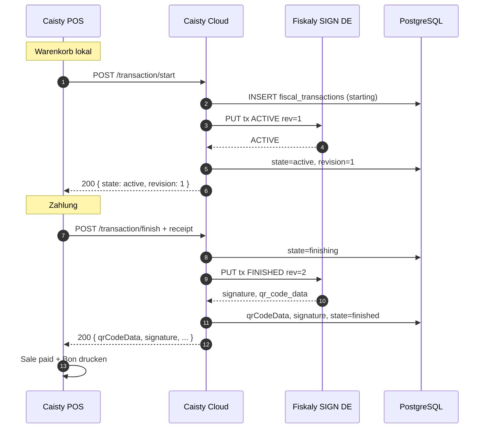

# Fiskaly POS ↔ Cloud API Contract

**Status:** Spezifikation (Single Source of Truth)  
**Version:** `1.0.0-draft`  
**Datum:** Juli 2026  
**Scope:** Vertrag zwischen **Caisty POS Desktop** und **Caisty Cloud API** — keine Fiskaly-Direktanbindung vom POS.

**Verwandte Dokumente:**

- [FISKALY-INTEGRATION.md](./FISKALY-INTEGRATION.md) — Architektur, Sequenzdiagramme, State Machine
- [FISKALY-IMPLEMENTATION-PLAN.md](./FISKALY-IMPLEMENTATION-PLAN.md) — Sprint-Plan

---

## 0. Grundsätze

```
Caisty POS Desktop
        │
        │  HTTPS JSON (dieses Dokument)
        ▼
Caisty Cloud API  ──►  Fiskaly SIGN DE / Management API
        │
        ▼
   PostgreSQL (Fiskal-IDs, Signaturen, Audit)
```

| Regel | Beschreibung |
|-------|--------------|
| **Kein Fiskaly vom POS** | POS kennt keine `api_key`, `api_secret`, `admin_pin`, Fiskaly-URLs |
| **Cloud als Proxy** | Alle Signierungen laufen über Cloud → Fiskaly `PUT /tss/{id}/tx/{tx_id}` |
| **Idempotenz** | Cloud ist authoritative für `tx_revision`; POS sendet stabile IDs |
| **Fail closed (DE certified)** | Bei Signing-Fehler: **kein** fiskalisch gültiger Bon; Verkauf blockieren |

### Base URL

| Environment | Base URL |
|-------------|----------|
| Production | `https://api.caisty.com` |
| Local dev | `http://localhost:3333` (ohne `/api`-Prefix am Server; siehe Hinweis unten) |

**Pfad-Präfix (Spezifikation):** `/api/pos/fiscal`

> **Hinweis zur Implementierung:** Bestehende POS-Endpunkte nutzen heute Pfade wie `/pos/config` ohne `/api`-Präfix. Neue Fiskal-Endpunkte werden gemäß diesem Contract unter `/api/pos/fiscal/*` registriert. Das POS verwendet `{CLOUD_BASE_URL}/api/pos/fiscal/...`.

---

## 1. Konventionen

### 1.1 Einheitliches Success-Format

Alle erfolgreichen Antworten (2xx):

```json
{
  "ok": true,
  "data": {},
  "meta": {
    "requestId": "550e8400-e29b-41d4-a716-446655440000",
    "timestamp": "2026-07-04T12:00:00.000Z",
    "apiVersion": "1.0"
  }
}
```

| Feld | Typ | Pflicht | Beschreibung |
|------|-----|---------|--------------|
| `ok` | boolean | Ja | Immer `true` bei Erfolg |
| `data` | object | Ja | Endpunkt-spezifische Nutzdaten |
| `meta.requestId` | string (UUID) | Ja | Korrelation Cloud-Logs / Support |
| `meta.timestamp` | string (ISO 8601 UTC) | Ja | Serverzeit der Antwort |
| `meta.apiVersion` | string | Ja | Contract-Version |

### 1.2 Einheitliches Fehlerformat

Alle Fehlerantworten (4xx, 5xx):

```json
{
  "ok": false,
  "error": {
    "code": "fiscal_signing_failed",
    "message": "Human-readable message for cashier or support.",
    "retryable": true,
    "details": {
      "fiskalyTxId": "550e8400-e29b-41d4-a716-446655440001",
      "revision": 2
    }
  },
  "meta": {
    "requestId": "550e8400-e29b-41d4-a716-446655440000",
    "timestamp": "2026-07-04T12:00:00.000Z",
    "apiVersion": "1.0"
  }
}
```

| Feld | Typ | Pflicht | Beschreibung |
|------|-----|---------|--------------|
| `ok` | boolean | Ja | Immer `false` |
| `error.code` | string | Ja | Maschinenlesbarer Code (snake_case) |
| `error.message` | string | Ja | Anzeige POS / Log |
| `error.retryable` | boolean | Ja | POS darf Request mit gleicher Idempotency wiederholen |
| `error.details` | object | Nein | Strukturierte Zusatzinfos (keine Secrets) |
| `meta` | object | Ja | Wie Success |

### 1.3 Namenskonventionen

| Bereich | Konvention | Beispiel |
|---------|------------|----------|
| JSON-Felder | `camelCase` | `posSaleRef`, `qrCodeData` |
| Error codes | `snake_case` | `fiscal_not_ready` |
| Fiskaly-IDs in Responses | `camelCase` mit Präfix | `fiskalyTxId`, `fiskalyClientId` |
| Enums | `SCREAMING_SNAKE` in JSON strings | `"FINISHED"`, `"NORMAL"` |

### 1.4 Datumsformat

- **API:** ISO 8601 UTC mit Millisekunden: `2026-07-04T12:00:00.000Z`
- **Fiskaly-Intern:** Cloud mappt auf Fiskaly unix timestamps wo nötig — **nicht** POS-Aufgabe
- **Anzeige POS:** Lokale Zeitzone des Terminals für UI; API immer UTC

### 1.5 IDs

| ID | Generator | Format | Sichtbar POS? |
|----|-----------|--------|---------------|
| `fiskalyTxId` | POS (Checkout-Start) | UUID v4 | Ja |
| `fiskalyClientId` | Cloud (Registrierung) | UUID v4 | Ja (Cache) |
| `fiskalyTssId` | Cloud (Onboarding) | UUID v4 | Ja (readonly) |
| `posSaleRef` | POS | string ≤ 128 | Ja |
| `requestId` | Cloud | UUID v4 | Ja (meta) |
| `managedOrgId` | Fiskaly | UUID | **Nein** |

**UUID v4:** RFC 4122, lowercase in JSON empfohlen.

### 1.6 Receipt Number

| Feld | Quelle | Beschreibung |
|------|--------|--------------|
| `receiptNumber` | POS | Fortlaufende Kassenbelegnummer **pro Gerät** (lokal); string, max 64 |
| `fiskalyTxNumber` | Fiskaly (nach Finish) | Fiskaly-interne Transaction-Nummer; integer; nur in Response |

POS druckt **beide** optional auf Bon: `receiptNumber` (Händler) + `fiskalyTxNumber` (TSE-Referenz).

### 1.7 Currency

- ISO 4217, 3 Buchstaben uppercase: `"EUR"`, `"CHF"`
- Beträge in Transaction-Payloads als **Dezimal-Strings** mit Punkt: `"10.50"` ( zwei Nachkommastellen empfohlen)
- POS sendet aggregierte Beträge pro USt-Satz; Cloud validiert Summen

### 1.8 Timezone

- API: **UTC** (ISO 8601 mit `Z`)
- `business.timezone` in Config (optional, z. B. `"Europe/Berlin"`) — für Export/Closing, nicht für Signing
- Fiskaly-Signatur-Timestamp kommt in Response `signature.signedAt` (UTC)

### 1.9 Idempotency-Key

| Endpunkt | Header | Regel |
|----------|--------|-------|
| `transaction/start` | `X-Idempotency-Key: {fiskalyTxId}:1` | Pflicht |
| `transaction/update` | `X-Idempotency-Key: {fiskalyTxId}:{revision}` | Pflicht |
| `transaction/finish` | `X-Idempotency-Key: {fiskalyTxId}:{revision}` | Pflicht |
| `transaction/cancel` | `X-Idempotency-Key: {fiskalyTxId}:{revision}` | Pflicht |
| `export` | `X-Idempotency-Key: {exportRequestId}` | Empfohlen |

Cloud speichert `(deviceId, idempotencyKey) → response` mindestens **24 h**.

Wiederholter Request mit gleichem Key → **identische Response** (200), kein Doppel-Signing.

### 1.10 Versionierung der API

| Mechanismus | Wert |
|-------------|------|
| Contract-Version | `1.0.0-draft` (dieses Dokument) |
| Response `meta.apiVersion` | `"1.0"` |
| Request-Header (optional) | `X-Caisty-Fiscal-Api-Version: 1.0` |
| Breaking Changes | Neuer Pfad `/api/pos/fiscal/v2/...` |

---

## 2. Authentifizierung (alle Endpunkte)

POS authentifiziert sich über **Device + License** (wie bestehend `/pos/config`).

### 2.1 Pflicht-Header

| Header | Beschreibung |
|--------|--------------|
| `Content-Type` | `application/json` (POST) |
| `X-Caisty-Device-Id` | UUID des gebundenen Cloud-Devices |
| `X-Caisty-License-Key` | Lizenzschlüssel (Plaintext) |
| `X-Idempotency-Key` | Siehe §1.9 (Transaction/Export) |

### 2.2 Alternative (deprecated)

Query-Parameter `deviceId` + `licenseKey` nur für **GET** `config` und `status` als Fallback — Header bevorzugt.

### 2.3 Validierung (Cloud)

1. License existiert und `status === active`
2. Device gebunden an License (`devices.license_id`)
3. Org hat `business_profiles` (DE)
4. Fiscal Setup: `fiscal.status === active` für Signing-Endpunkte

Bei Fehler: `403` / `404` mit `error.code` (siehe je Endpunkt).

---

## 3. Endpunkte

---

### 3.1 GET `/api/pos/fiscal/config`

#### Zweck

Liefert Fiskal-Konfiguration für das POS: Business-Kontext, Receipt-Modus, Fiskaly-Referenz-IDs (ohne Secrets), Sync-Version. Erweitert das bestehende `/pos/config`-Fiskal-Subset.

#### HTTP

| | |
|---|---|
| Methode | `GET` |
| URL | `/api/pos/fiscal/config` |

#### Authentifizierung

Header `X-Caisty-Device-Id` + `X-Caisty-License-Key` (oder Query `deviceId`, `licenseKey`).

#### Request

Kein Body.

**Query (optional):**

| Parameter | Typ | Beschreibung |
|-----------|-----|--------------|
| `sinceConfigVersion` | integer | Inkrementeller Sync — antwortet 304 wenn unverändert (optional, Phase 2) |

#### Response `data`

```json
{
  "business": {
    "companyName": "Café Berlin GmbH",
    "legalName": "Café Berlin GmbH",
    "country": "DE",
    "currency": "EUR",
    "defaultLanguage": "de",
    "street": "Unter den Linden 1",
    "city": "Berlin",
    "postalCode": "10117",
    "vatId": "DE123456789",
    "taxNumber": "27/123/45678",
    "timezone": "Europe/Berlin",
    "updatedAt": "2026-07-01T10:00:00.000Z"
  },
  "fiscal": {
    "fiscalRequired": true,
    "provider": "fiskaly",
    "providerLabel": "Caisty Fiscal Germany powered by Fiskaly",
    "receiptMode": "certified",
    "status": "active",
    "environment": "sandbox",
    "countryRule": "de_fiskaly_api",
    "fiskalyTssId": "a1b2c3d4-e5f6-7890-abcd-ef1234567890",
    "fiskalyClientId": "b2c3d4e5-f6a7-8901-bcde-f12345678901",
    "fiskalyClientSerial": "caisty-device-b2c3d4e5",
    "supportedExports": ["DSFinV-K", "TSE TAR"],
    "notice": null
  },
  "device": {
    "id": "d1e2f3a4-b5c6-7890-def1-234567890abc",
    "name": "Kasse 1",
    "fingerprint": "fp-abc123"
  },
  "license": {
    "id": "lic-uuid",
    "plan": "starter",
    "status": "active",
    "maxDevices": 3
  },
  "sync": {
    "configVersion": 42,
    "updatedAt": "2026-07-04T11:00:00.000Z"
  },
  "capabilities": {
    "signing": true,
    "export": false
  }
}
```

#### Pflichtfelder Response

`business.*`, `fiscal.fiscalRequired`, `fiscal.receiptMode`, `fiscal.status`, `sync.configVersion`, `device.id`.

#### Optionale Felder

`fiscal.fiskalyClientId` (null bis Client registriert), `fiscal.notice`, `capabilities.export`.

#### HTTP-Statuscodes

| Code | Bedeutung |
|------|-----------|
| 200 | Config geliefert |
| 304 | Unverändert (`sinceConfigVersion`) |
| 400 | Fehlende Auth-Parameter |
| 403 | `invalid_license`, `device_not_bound` |
| 404 | `business_profile_missing`, `org_not_found` |
| 500 | `server_error` |

#### Fehlercodes

| code | retryable | Beschreibung |
|------|-----------|--------------|
| `invalid_request` | false | Parameter fehlen |
| `invalid_license` | false | Lizenz ungültig/inaktiv |
| `device_not_bound` | false | Device nicht an License |
| `business_profile_missing` | false | Portal Business unvollständig |
| `fiscal_not_ready` | true | Setup läuft (`pending_setup`) |
| `server_error` | true | Interner Fehler |

#### Idempotenz / Retry

Safe (GET). Retry beliebig.

#### Validierung

Cloud prüft License/Device-Bindung; kein Body.

#### Beispiel

```http
GET /api/pos/fiscal/config HTTP/1.1
Host: api.caisty.com
X-Caisty-Device-Id: d1e2f3a4-b5c6-7890-def1-234567890abc
X-Caisty-License-Key: CAIS-XXXX-XXXX-XXXX
```

---

### 3.2 POST `/api/pos/fiscal/transaction/start`

#### Zweck

Startet Fiskaly-Checkout-Transaction (`ACTIVE`, `tx_revision=1`, leeres Schema). Entspricht Fiskaly `PUT …/tx/{id}?tx_revision=1`.

#### HTTP

| | |
|---|---|
| Methode | `POST` |
| URL | `/api/pos/fiscal/transaction/start` |

#### Request JSON

```json
{
  "fiskalyTxId": "550e8400-e29b-41d4-a716-446655440001",
  "posSaleRef": "sale-20260704-0042",
  "receiptNumber": "2026-0042",
  "metadata": {
    "cashierId": "user-12",
    "terminalLabel": "Kasse 1"
  }
}
```

| Feld | Typ | Pflicht | Validierung |
|------|-----|---------|-------------|
| `fiskalyTxId` | UUID v4 | Ja | Neu pro Checkout; POS-generiert |
| `posSaleRef` | string | Ja | Max 128; eindeutig pro Device empfohlen |
| `receiptNumber` | string | Nein | Max 64 |
| `metadata` | object | Nein | Max 10 keys; values string ≤ 256 |

#### Response `data`

```json
{
  "fiskalyTxId": "550e8400-e29b-41d4-a716-446655440001",
  "state": "active",
  "fiskalyState": "ACTIVE",
  "revision": 1,
  "fiskalyClientId": "b2c3d4e5-f6a7-8901-bcde-f12345678901",
  "fiskalyTssId": "a1b2c3d4-e5f6-7890-abcd-ef1234567890",
  "startedAt": "2026-07-04T12:00:00.000Z"
}
```

#### HTTP-Statuscodes

| Code | Bedeutung |
|------|-----------|
| 200 | Transaction gestartet (oder idempotent replay) |
| 400 | Validierungsfehler |
| 403 | Auth / fiscal nicht active |
| 409 | `fiskalyTxId` bereits finished/cancelled |
| 503 | Fiskaly TSS locked / signing unavailable |

#### Fehlercodes

| code | retryable |
|------|-----------|
| `invalid_request` | false |
| `fiscal_not_ready` | true |
| `fiscal_signing_failed` | true |
| `transaction_already_closed` | false |
| `tss_locked` | true |

#### Idempotenz

`X-Idempotency-Key: {fiskalyTxId}:1`

#### Retry (POS)

Wenn `retryable: true` → gleicher Request nach 500 ms, max 3×.

#### Validierung Cloud

- `fiscal.status === active` und `fiskalyClientId` vorhanden
- `fiskalyTxId` UUID v4
- Kein bestehender DB-Eintrag in `finished`/`cancelled`

---

### 3.3 POST `/api/pos/fiscal/transaction/update`

#### Zweck

Optionales Update während Checkout (`ACTIVE`, revision++). Für Gastronomie / lange Vorgänge. Retail kann überspringen.

#### Request JSON

```json
{
  "fiskalyTxId": "550e8400-e29b-41d4-a716-446655440001",
  "revision": 2,
  "metadata": {
    "itemCount": "5"
  }
}
```

| Feld | Pflicht | Beschreibung |
|------|---------|--------------|
| `fiskalyTxId` | Ja | Gleiche ID wie start |
| `revision` | Ja | Erwartete nächste Revision (= last + 1) |
| `metadata` | Nein | Wird an Fiskaly metadata gemerged |

#### Response `data`

```json
{
  "fiskalyTxId": "550e8400-e29b-41d4-a716-446655440001",
  "state": "active",
  "fiskalyState": "ACTIVE",
  "revision": 2
}
```

#### HTTP-Statuscodes

200, 400, 403, 409 (`revision_mismatch`), 503

#### Fehlercodes

| code | retryable |
|------|-----------|
| `revision_mismatch` | true (nach GET status revision neu laden) |
| `transaction_not_active` | false |

#### Idempotenz

`X-Idempotency-Key: {fiskalyTxId}:{revision}`

---

### 3.4 POST `/api/pos/fiscal/transaction/finish`

#### Zweck

Schließt Verkauf ab — Fiskaly `FINISHED` mit Receipt-Schema. Liefert Signatur + QR-Code ans POS.

#### Request JSON

```json
{
  "fiskalyTxId": "550e8400-e29b-41d4-a716-446655440001",
  "revision": 2,
  "posSaleRef": "sale-20260704-0042",
  "receiptNumber": "2026-0042",
  "receipt": {
    "receiptType": "RECEIPT",
    "amountsPerVatRate": [
      { "vatRate": "NORMAL", "amount": "8.40" },
      { "vatRate": "REDUCED_1", "amount": "1.60" }
    ],
    "amountsPerPaymentType": [
      { "paymentType": "CASH", "amount": "10.00", "currencyCode": "EUR" }
    ]
  },
  "lineItems": [
    {
      "quantity": "2",
      "text": "Espresso",
      "pricePerUnit": "2.50",
      "vatRate": "NORMAL"
    }
  ],
  "metadata": {
    "paymentMethodLabel": "Bar"
  }
}
```

**Pflicht:** `fiskalyTxId`, `revision`, `receipt.receiptType`, `receipt.amountsPerVatRate`, `receipt.amountsPerPaymentType`.

**`vatRate` Enum (Fiskaly):** `NORMAL`, `REDUCED_1`, `REDUCED_2`, `SPECIAL_RATE_1`, `SPECIAL_RATE_2`, `NULL`  
**`paymentType` Enum:** `CASH`, `NON_CASH`, `INTERNAL`, `VOUCHER`, …

**Validierung Cloud:**

- Summe `amountsPerVatRate` ≈ Summe `amountsPerPaymentType` (±0.01)
- Alle Beträge Decimal-String regex: `^-?\d+\.\d{2}$`
- Storno: negative Beträge, `receiptType: RECEIPT`

#### Response `data`

```json
{
  "fiskalyTxId": "550e8400-e29b-41d4-a716-446655440001",
  "state": "finished",
  "fiskalyState": "FINISHED",
  "revision": 2,
  "fiskalyTxNumber": 1842,
  "receiptNumber": "2026-0042",
  "signature": {
    "value": "MEUCIQDx...",
    "algorithm": "ecdsa-plain-SHA256",
    "counter": "1842",
    "publicKey": "MFkwEwYH...",
    "signedAt": "2026-07-04T12:00:05.000Z",
    "tssSerialNumber": "a1b2c3d4e5f6..."
  },
  "qrCodeData": "V0;955002-00;Kassenbeleg-V1;Beleg^8.40_1.60_0.00_0.00_0.00^10.00:Bar;...",
  "finishedAt": "2026-07-04T12:00:05.000Z"
}
```

#### HTTP-Statuscodes

200, 400, 403, 409, 503

#### Fehlercodes

| code | retryable | POS-Aktion |
|------|-----------|------------|
| `schema_validation_failed` | false | Verkauf abbrechen, Daten korrigieren |
| `fiscal_signing_failed` | true | Retry |
| `transaction_not_active` | false | Reconcile via GET status |
| `transaction_already_finished` | false | Idempotent: Response nutzen |

#### Idempotenz

`X-Idempotency-Key: {fiskalyTxId}:{revision}` — bei Replay identische `qrCodeData`.

#### Retry

`retryable: true` → max 3×, Backoff 500 ms–2 s. **Kein** neuer `fiskalyTxId`.

---

### 3.5 POST `/api/pos/fiscal/transaction/cancel`

#### Zweck

Checkout abgebrochen vor Zahlung → Fiskaly `CANCELLED`.

#### Request JSON

```json
{
  "fiskalyTxId": "550e8400-e29b-41d4-a716-446655440001",
  "revision": 2,
  "reason": "user_abort"
}
```

| Feld | Pflicht |
|------|---------|
| `fiskalyTxId` | Ja |
| `revision` | Ja (= last + 1) |
| `reason` | Nein (`user_abort`, `timeout`, `error_recovery`) |

#### Response `data`

```json
{
  "fiskalyTxId": "550e8400-e29b-41d4-a716-446655440001",
  "state": "cancelled",
  "fiskalyState": "CANCELLED",
  "revision": 2,
  "cancelledAt": "2026-07-04T12:00:03.000Z"
}
```

#### HTTP-Statuscodes

200, 400, 403, 409, 503

#### Fehlercodes

| code | retryable |
|------|-----------|
| `transaction_not_active` | false |
| `transaction_already_finished` | false |

Kein `qrCodeData` in Response.

---

### 3.6 GET `/api/pos/fiscal/status`

#### Zweck

Aggregierter Fiskal-Status für POS Cloud-Hub UI: Connection, letzter Sync, offene Transaction, Setup-Fehler.

#### HTTP

| | |
|---|---|
| Methode | `GET` |
| URL | `/api/pos/fiscal/status` |

#### Request

Header Auth (wie config). Optional Query `fiskalyTxId` für Einzel-Transaction-Status.

#### Response `data`

```json
{
  "connection": {
    "kind": "connected",
    "label": "Connected to Caisty Cloud"
  },
  "fiscal": {
    "status": "active",
    "receiptMode": "certified",
    "environment": "sandbox",
    "signingAvailable": true
  },
  "lastCloudSyncAt": "2026-07-04T11:55:00.000Z",
  "openTransaction": {
    "fiskalyTxId": "550e8400-e29b-41d4-a716-446655440001",
    "state": "active",
    "revision": 1,
    "startedAt": "2026-07-04T12:00:00.000Z"
  },
  "lastError": null
}
```

#### HTTP-Statuscodes

200, 400, 403

#### Retry

Safe GET.

---

### 3.7 POST `/api/pos/fiscal/export`

#### Zweck

Stößt **TAR-Export** (SIGN DE) für die Org/TSS an — typisch nach Kassenabschluss. **Asynchron**; Ergebnis per Portal/Admin, nicht synchron im POS (optional Status-Polling).

> POS-Export ist **optional** (Feature `capabilities.export`). Primärer Export-Kanal: Admin/Portal.

#### Request JSON

```json
{
  "exportRequestId": "770e8400-e29b-41d4-a716-446655440099",
  "type": "TAR",
  "dateRange": {
    "start": "2026-07-01T00:00:00.000Z",
    "end": "2026-07-04T23:59:59.999Z"
  }
}
```

| Feld | Pflicht | Beschreibung |
|------|---------|--------------|
| `exportRequestId` | Ja | UUID v4, POS oder Cloud |
| `type` | Ja | `"TAR"` (Phase 1); `"DSFINVK"` später Admin-only |
| `dateRange` | Ja | UTC ISO |

#### Response `data`

```json
{
  "exportRequestId": "770e8400-e29b-41d4-a716-446655440099",
  "fiskalyExportId": "880e8400-e29b-41d4-a716-446655440088",
  "state": "pending",
  "message": "Export queued. Download via Customer Portal when ready."
}
```

#### HTTP-Statuscodes

202 Accepted (async), 400, 403, 409 (duplicate export), 503

#### Fehlercodes

| code | retryable |
|------|-----------|
| `export_in_progress` | true |
| `export_not_allowed_during_sales` | true |
| `fiscal_not_ready` | false |

#### Idempotenz

`X-Idempotency-Key: {exportRequestId}`

#### Retry

Poll nicht auf POS — Cloud Job. Bei 503 retry nach 60 s.

---

### 3.8 GET `/api/pos/fiscal/health`

#### Zweck

Leichtgewichtiger Ping: Cloud erreichbar, Device auth OK, Fiskaly-Pfad grundsätzlich nutzbar (ohne Signing).

#### Response `data`

```json
{
  "cloud": "ok",
  "deviceAuth": "ok",
  "fiscal": {
    "status": "active",
    "signingAvailable": true,
    "fiskalyReachable": true
  },
  "latencyMs": 42
}
```

#### HTTP-Statuscodes

200 (alles ok), 200 mit `signingAvailable: false`, 403 (auth fail), 503 (cloud degraded)

#### Retry

Safe; Intervall POS ≥ 60 s empfohlen.

---

## 4. Lifecycle einer vollständigen Transaktion



### Zustands-Mapping (Kurz)

| Schritt | POS lokal | Cloud DB | Fiskaly |
|---------|-----------|----------|---------|
| Nach start | checkout_open | active | ACTIVE |
| Nach finish | receipt_printed | finished | FINISHED |
| Nach cancel | cart_cleared | cancelled | CANCELLED |

**Abgeschlossen (compliance):** erst wenn POS `finish` 200 mit `qrCodeData` erhalten hat.

---

## 5. Datenhoheit

### 5.1 Ausschließlich Cloud (POS darf NICHT kennen)

| Daten | Grund |
|-------|-------|
| Fiskaly API Key + Secret | Security |
| Management API Credentials | Integrator-level |
| Access / Refresh Tokens | Security |
| Admin PUK / Admin PIN | TSS-Admin |
| `managedOrgId` (intern) | Nicht POS-relevant |
| Fiskaly Base URLs | Encapsulation |
| Idempotency-Store / Retry-Queue | Intern |
| Vollständige `fiscal_transactions` History | Audit / Admin |
| Export-TAR Binary Storage | Größe / Portal |

### 5.2 POS darf kennen (und lokal cachen)

| Daten | Verwendung |
|-------|------------|
| `fiskalyTxId` | Checkout-Session |
| `fiskalyClientId`, `fiskalyTssId` | Config-Cache |
| `revision` | Finish/Cancel |
| `qrCodeData` | Bon-Druck |
| `signature.*` (public fields) | Bon + Reprint |
| `fiskalyTxNumber` | Bon-Fußzeile |
| `receiptMode`, `fiscal.status` | UI / Gating |
| `configVersion` | Sync |
| `error.code`, `retryable` | Fehlerbehandlung |

### 5.3 Dauerhaft in Cloud gespeichert (Fiskaly-bezogen)

| Datensatz | Felder | Retention |
|-----------|--------|-----------|
| `fiskaly_credentials` | encrypted keys, managed_org_id | Lebensdauer Org |
| `fiskaly_tss` | tss_id, state, serial_number | Lebensdauer Org |
| `fiskaly_clients` | client_id, device_id, serial_number | Bis DEREGISTERED + Audit |
| `fiscal_transactions` | tx_id, revision, signature, qr_code_data, states | **Gesetzliche Aufbewahrung** (10+ Jahre DE) |
| `fiscal_exports` | export_id, storage_path, state | Bis expiration + Archiv |

**Nicht dauerhaft:** Access Tokens (Cache), Admin PIN/PUK, raw Fiskaly error stacks (nur Logs).

---

## 6. Fehlercode-Referenz (Gesamt)

| code | HTTP | retryable | Endpunkte |
|------|------|-----------|-----------|
| `invalid_request` | 400 | false | alle |
| `invalid_license` | 403 | false | alle |
| `device_not_bound` | 403 | false | alle |
| `business_profile_missing` | 404 | false | config |
| `fiscal_not_ready` | 403 | true | start/finish |
| `fiscal_signing_failed` | 503 | true | start/finish/cancel |
| `tss_locked` | 503 | true | start/finish/cancel |
| `transaction_already_closed` | 409 | false | start |
| `transaction_already_finished` | 409 | false | finish/cancel |
| `transaction_not_active` | 409 | false | finish/cancel/update |
| `revision_mismatch` | 409 | true | update/finish/cancel |
| `schema_validation_failed` | 400 | false | finish |
| `export_in_progress` | 409 | true | export |
| `server_error` | 500 | true | alle |

---

## 7. POS-Implementierungs-Checkliste

- [ ] Alle Calls an `{CLOUD_BASE_URL}/api/pos/fiscal/*`
- [ ] Niemals Fiskaly-URLs oder Keys im Code
- [ ] `fiskalyTxId` = `crypto.randomUUID()` pro Checkout
- [ ] `X-Idempotency-Key` auf allen Transaction-POSTs
- [ ] Bei `retryable: true` exponential backoff, max 3
- [ ] Bei `fiscal_signing_failed` / kein QR: **Verkauf nicht abschließen**
- [ ] `qrCodeData` unverändert an Drucker
- [ ] Config sync bei `configVersion`-Änderung (`GET config`)

---

## 8. Changelog

| Version | Datum | Änderung |
|---------|-------|----------|
| 1.0.0-draft | 2026-07-04 | Initial contract |

---

*Spezifikationsdokument — keine Codeänderungen, Migrationen oder Implementierungen.*
