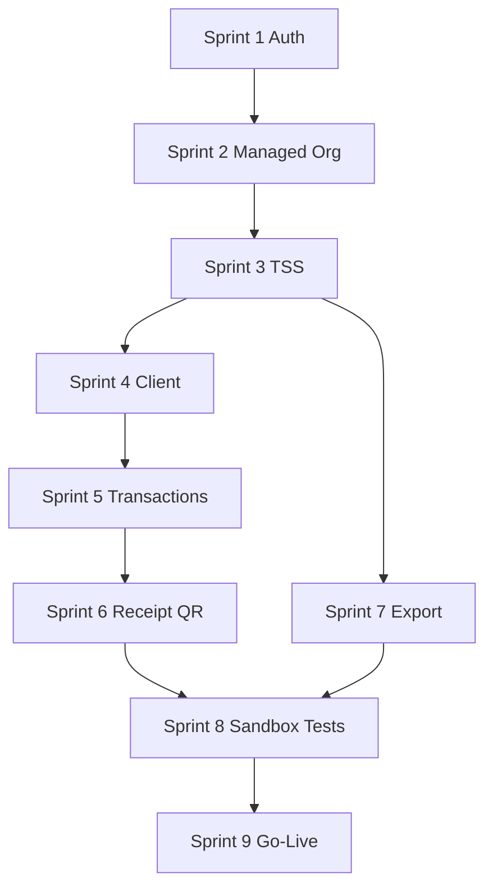

# Fiskaly SIGN DE — Implementierungsplan (Caisty Cloud)

**Status:** Planung — keine Implementierung  
**Datum:** Juli 2026  
**Basis:** [FISKALY-INTEGRATION.md](./FISKALY-INTEGRATION.md)  
**Scope:** Caisty Cloud API, Admin, Portal, POS (Consumer) — schrittweise Ausrollung

---

## Übersicht

| Sprint | Fokus | Abhängigkeit |
|--------|-------|--------------|
| 1 | Credentials / Auth | — |
| 2 | Managed Organization | Sprint 1 |
| 3 | TSS | Sprint 2 |
| 4 | Client Registration | Sprint 3 |
| 5 | Transaction Start/Update/Finish | Sprint 4 |
| 6 | Receipt / QR-Code | Sprint 5 |
| 7 | Export TAR / DSFinV-K | Sprint 3 |
| 8 | Tests / Sandbox | Sprint 1–7 |
| 9 | Production Go-Live | Sprint 8 |

**Prinzipien:**

- Alle Fiskaly-Secrets und Tokens **nur** in Cloud API.
- TEST-Environment (Fiskaly Sandbox) bis Sprint 8 abgeschlossen.
- Jeder Sprint ist **deploybar** und **rollback-fähig** ohne vorherige Sprints zu brechen (Feature Flags).

---

## Sprint 1: Credentials / Auth

### Ziel

Caisty Cloud kann sich als **Integrator** (Management API) und pro **Managed Org** (SIGN DE API) authentifizieren. Token-Cache und Refresh sind implementiert — noch ohne Onboarding-Flow.

### Betroffene Dateien (geplant)

| Bereich | Dateien |
|---------|---------|
| Config | `apps/cloud-api/src/config/env.ts`, `.env.example` |
| Fiskaly Client | `apps/cloud-api/src/fiscal/fiskaly/FiskalySignDeClient.ts` *(neu)* |
| Fiskaly Client | `apps/cloud-api/src/fiscal/fiskaly/FiskalyManagementClient.ts` *(neu)* |
| Token Cache | `apps/cloud-api/src/fiscal/fiskaly/FiskalyTokenCache.ts` *(neu)* |
| Provider | `apps/cloud-api/src/fiscal/providers/FiskalyFiscalProvider.ts` |
| Tests | `apps/cloud-api/src/fiscal/fiskaly/__tests__/auth.test.ts` *(neu)* |

### Datenbankbedarf

| Änderung | Beschreibung |
|----------|--------------|
| Migration `021_fiskaly_credentials.sql` *(später)* | `fiskaly_credentials` Tabelle |
| Optional Sprint 1 | Nur Env-Vars für Caisty-Integrator-Key; Org-Keys ab Sprint 2 |

**Spalten (Vorschau):** `org_id`, `managed_org_id`, `api_key_encrypted`, `api_secret_encrypted`, `environment`, `created_at`.

### API-Endpunkte (geplant)

| Endpunkt | Methode | Sprint-1-Zweck |
|----------|---------|----------------|
| `/health` | GET | Erweiterung: `fiskalyAuthOk: boolean` (interner Ping) |
| `/internal/fiscal/token/refresh` | POST | Manueller Token-Test (dev-only oder admin) |

*Keine POS-Endpunkte in Sprint 1.*

### Tests

- Unit: Token-Cache speichert/liefert Access Token.
- Unit: Bei mock 401 → Refresh-Flow mit `refresh_token`.
- Unit: Bei abgelaufenem Refresh → Re-Auth mit API Key + Secret.
- Integration (TEST): `POST /api/v2/auth` gegen Fiskaly Sandbox mit Test-Key.
- Integration: Management API `POST /api/v0/auth`.

### Risiken

| Risiko | Mitigation |
|--------|------------|
| Secret-Leak in Logs | Structured logging ohne Secrets; Redaction |
| Token-Cache Multi-Instance | Redis oder DB-backed Cache (später); Sprint 1 In-Memory + Dokumentation |
| Falsche Base URL TEST/LIVE | Env-Validierung beim Start |

### Rollback

- Feature Flag `FISKALY_AUTH_ENABLED=false` → Provider bleibt Mock.
- Migration rückgängig (falls schon angewendet): Tabelle `fiskaly_credentials` droppen.
- Env-Vars entfernen → kein Verhalten change für Bestandskunden.

---

## Sprint 2: Managed Organization

### Ziel

Automatisches Anlegen einer **Fiskaly Managed Organization** pro Caisty-`org`, wenn Business Profile (DE) vollständig ist. API-Key pro Org erzeugen und verschlüsselt speichern.

### Betroffene Dateien (geplant)

| Bereich | Dateien |
|---------|---------|
| Service | `apps/cloud-api/src/fiscal/fiskaly/FiskalyOnboardingService.ts` *(neu)* |
| Provider | `apps/cloud-api/src/fiscal/providers/FiskalyFiscalProvider.ts` → `startSetup()` |
| Routes | `apps/cloud-api/src/routes/portal-business.ts` (Trigger nach PATCH DE) |
| Routes | `apps/cloud-api/src/routes/admin/fiscal.ts` (POST setup) |
| Jobs | `apps/cloud-api/src/fiscal/fiskaly/onboardingWorker.ts` *(neu)* |
| Rules | `apps/cloud-api/src/lib/businessProfileRules.ts` |
| Admin UI | `apps/cloud-admin/src/pages/Fiscal/FiscalCompliancePage.tsx` |
| Portal UI | `apps/caisty-site/src/routes/PortalBusinessPage.tsx` |

### Datenbankbedarf

| Änderung | Beschreibung |
|----------|--------------|
| Migration `021` oder `022` | `fiskaly_credentials` |
| `business_profiles` | + `fiskaly_managed_org_id`, `fiskaly_setup_started_at`, `fiskaly_setup_error` |

### API-Endpunkte (geplant)

| Endpunkt | Methode | Auth |
|----------|---------|------|
| `/admin/fiscal/customers/:customerId/setup` | POST | Admin JWT |
| `/portal/business/fiscal/setup` | POST | Portal JWT (optional) |
| `/internal/fiscal/onboard/:orgId` | POST | Internal |
| `/admin/fiscal/customers/:customerId/status` | GET | Admin JWT |
| `/portal/business/fiscal/status` | GET | Portal JWT |

**Fiskaly (intern):** `POST /api/v0/organizations`, `POST /api/v0/organizations/{id}/api-keys`.

### Tests

- Unit: Mapping `business_profiles` → Management API Payload.
- Integration: Managed Org in TEST anlegen + Key speichern.
- E2E: Portal PATCH DE → `pending_setup` → Worker → `managed_org_id` gesetzt.
- Idempotenz: Doppelter Setup-Call erzeugt keine zweite Org.

### Risiken

| Risiko | Mitigation |
|--------|------------|
| API Secret nur einmal sichtbar | Sofort encrypt + persist; Fehler wenn Speichern fehlschlägt |
| Unvollständiges Business Profile | Validierung vor Setup; klare Portal-Fehler |
| Management Token Timeout (~300 s) | Worker refresht Token mid-job |

### Rollback

- Flag `FISKALY_ONBOARDING_ENABLED=false`.
- Bestehende `managed_org_id` ignorieren; Status manuell auf `pending_setup`.
- Fiskaly TEST-Orgs können in HUB manuell gelöscht werden (TEST only).

---

## Sprint 3: TSS

### Ziel

Vollständige TSS-Pipeline: CREATE → UNINITIALIZED → Admin PIN → INITIALIZED → Logout. `fiskaly_tss` persistiert; `fiscal_status` → `active` wenn TSS bereit.

### Betroffene Dateien (geplant)

| Bereich | Dateien |
|---------|---------|
| Service | `apps/cloud-api/src/fiscal/fiskaly/FiskalyTssService.ts` *(neu)* |
| Onboarding | `FiskalyOnboardingService.ts` (TSS-Schritte) |
| DB Schema | `apps/cloud-api/src/db/schema/fiskalyTss.ts` *(neu)* |
| Provider | `FiskalyFiscalProvider.getStatus()` — liest echten TSS-State |
| buildFiscal | `buildFiscalConfiguration.ts`, `fiscalConfigurationService.ts` |
| Health | `apps/cloud-api/src/routes/health.ts` |

### Datenbankbedarf

| Änderung | Beschreibung |
|----------|--------------|
| Migration `023_fiskaly_tss.sql` | Tabelle `fiskaly_tss` |
| `fiscal_configurations` | + `fiskaly_tss_state`, `fiskaly_tss_serial` |

### API-Endpunkte (geplant)

Keine neuen öffentlichen Endpunkte — TSS läuft innerhalb Onboarding-Worker.

**Erweiterung bestehend:**

| Endpunkt | Änderung |
|----------|----------|
| `GET /portal/business` | `fiscal.tssState`, `fiscal.tssSerial` (read-only) |
| `GET /admin/fiscal/customers/:id` | TSS-Block |

**Fiskaly (intern):** `PUT/PATCH /tss/*`, `PATCH /tss/{id}/admin`, `POST admin/auth`, `POST admin/logout`.

### Tests

- Integration: TSS in TEST bis INITIALIZED (Timeout 30 s).
- Unit: State-Machine-Übergänge validieren.
- Negative: Fehlender admin_puk → `fiskaly_setup_error` gesetzt.
- Health: `portalBusinessRoute` + `fiskalyTssOk` für Test-Org.

### Risiken

| Risiko | Mitigation |
|--------|------------|
| 30 s Timeout | Async Worker + UI Spinner; kein synchroner Portal-Request |
| Admin PIN Speicherung | PIN **nicht** persistieren; nur `admin_pin_set=true` |
| TEST TSS DELETED (Sonntag) | Reconcile-Job; Status → `pending_setup` |

### Rollback

- Worker stoppen; TSS in Fiskaly TEST belassen (harmlos).
- DB: `fiskaly_tss` rows löschen; `fiscal_status=pending_setup`.
- Kein POS-Impact (noch kein Signing).

---

## Sprint 4: Client Registration

### Ziel

Bei Device-Bind / erstem POS-Sync wird ein Fiskaly **Client** pro Caisty-`device` registriert. POS erhält `client_id` über Cloud (ohne Secrets).

### Betroffene Dateien (geplant)

| Bereich | Dateien |
|---------|---------|
| Routes | `apps/cloud-api/src/routes/pos-fiscal.ts` *(neu)* oder Erweiterung `pos-config.ts` |
| Service | `apps/cloud-api/src/fiscal/fiskaly/FiskalyClientService.ts` *(neu)* |
| DB | `apps/cloud-api/src/db/schema/fiskalyClients.ts` *(neu)* |
| Devices | `apps/cloud-api/src/db/schema/devices.ts` (+ Spalten) |
| POS | `Caisty-Pos/src/lib/cloudApi.js`, `cloudSyncService.js` |
| POS | `Caisty-Pos/src/fiscal/cloudFiscal.js` |

### Datenbankbedarf

| Änderung | Beschreibung |
|----------|--------------|
| Migration `024_fiskaly_clients.sql` | `fiskaly_clients` |
| `devices` | + `fiskaly_client_id`, `fiskaly_client_serial` |

### API-Endpunkte (geplant)

| Endpunkt | Methode | Auth |
|----------|---------|------|
| `/pos/fiscal/client/register` | POST | deviceId + licenseKey |
| `GET /pos/config` | GET | Erweiterung: `fiscal.clientId`, `fiscal.tssId` (keine Secrets) |

**Fiskaly (intern):** `PUT /tss/{tss_id}/client/{client_id}`.

### Tests

- Integration: Client REGISTERED nach Register-Call.
- Unit: `serial_number` Sanitizer (kein `/`, `_`, max 70).
- POS Unit: `cloud.test.js` — Config enthält clientId.
- Re-Bind: neues Device → neuer Client; altes DEREGISTERED.

### Risiken

| Risiko | Mitigation |
|--------|------------|
| serial_number permanent falsch | Validierung vor PUT; Device-ID als Default |
| Client ohne INITIALIZED TSS | Guard: TSS state check |
| Doppel-Register | Idempotenz: gleiches device → gleiche client_id |

### Rollback

- Endpunkt deaktivieren; POS nutzt weiterhin Standard-Receipt-Modus lokal.
- `fiskaly_clients` leeren; POS-Cache invalidieren via config_version bump.

---

## Sprint 5: Transaction Start / Update / Finish

### Ziel

Cloud proxyt Fiskaly-Transactions: Checkout-Start (ACTIVE), optionale Updates, Finish (FINISHED). Idempotenz und TSS-Queue implementiert.

### Betroffene Dateien (geplant)

| Bereich | Dateien |
|---------|---------|
| Routes | `apps/cloud-api/src/routes/pos-fiscal.ts` |
| Service | `apps/cloud-api/src/fiscal/fiskaly/FiskalyTransactionService.ts` *(neu)* |
| Queue | `apps/cloud-api/src/fiscal/fiskaly/FiskalyTssQueue.ts` *(neu)* |
| DB | `apps/cloud-api/src/db/schema/fiscalTransactions.ts` *(neu)* |
| Mapper | `apps/cloud-api/src/fiscal/fiskaly/mapSaleToReceiptSchema.ts` *(neu)* |
| POS | `Caisty-Pos/src/lib/cloudApi.js` — transaction endpoints |
| POS | `Caisty-Pos/src/pages/POS.jsx` — Checkout-Hook |

### Datenbankbedarf

| Änderung | Beschreibung |
|----------|--------------|
| Migration `025_fiscal_transactions.sql` | `fiscal_transactions` |
| Index | UNIQUE `(org_id, fiskaly_tx_id, revision)` für Idempotenz |

### API-Endpunkte (geplant)

| Endpunkt | Methode | Auth |
|----------|---------|------|
| `/pos/fiscal/transaction/start` | POST | device + license |
| `/pos/fiscal/transaction/update` | POST | optional (Gastro) |
| `/pos/fiscal/transaction/finish` | POST | device + license |
| `/pos/fiscal/transaction/cancel` | POST | device + license |
| `/pos/fiscal/transaction/:txId` | GET | Reconciliation |

**Fiskaly (intern):** `PUT /tss/{id}/tx/{tx_id}?tx_revision=N`.

### Tests

- Unit: Revision-Inkrement, Idempotenz-Lookup.
- Unit: Receipt-Mapper (USt NORMAL/REDUCED, CASH/NON_CASH).
- Integration: Start → Finish in TEST; DB state `finished`.
- Integration: Cancel flow.
- Load: TSS-Queue bei parallelen Requests (2 Kassen).

### Risiken

| Risiko | Mitigation |
|--------|------------|
| 2000 ACTIVE Limit | Cancel-TTL-Job für verwaiste Tx |
| TSS Serialisierung Latenz | Queue + User-Feedback „Signierung…“ |
| POS-Absturz nach start | Reconcile cancel nach 30 min |

### Rollback

- Flag `FISKALY_SIGNING_ENABLED=false` → Endpunkte 503; POS blockiert Checkout in DE certified mode.
- Offene Fiskaly ACTIVE manuell canceln (Admin-Tool Sprint 8).

---

## Sprint 6: Receipt / QR-Code

### Ziel

POS druckt KassenSichV-konformen Bon mit `qr_code_data`. Cloud persistiert Signatur-Metadaten. Reprint aus gespeicherten Daten möglich.

### Betroffene Dateien (geplant)

| Bereich | Dateien |
|---------|---------|
| DB | `fiscal_transactions` — `qr_code_data`, `signature_*` bereits Sprint 5 |
| POS | `Caisty-Pos/src/lib/receiptPrint.js` *(oder äquivalent)* |
| POS | Receipt-Template / ESC-POS QR-Rendering |
| Portal | Optional: Sale-Detail mit Fiskal-Info (read-only) |
| Admin | Customer Detail — letzte Transactions |

### Datenbankbedarf

Keine neue Migration — Felder aus Sprint 5 nutzen.

Optional: `fiscal_transaction_events` Audit-Log (nice-to-have).

### API-Endpunkte (geplant)

| Endpunkt | Methode | Zweck |
|----------|---------|-------|
| `GET /pos/fiscal/transaction/:txId` | GET | Reprint-Daten für POS |
| `GET /admin/fiscal/transactions` | GET | Admin-Liste (optional) |

### Tests

- Unit: QR-String unverändert an Drucker übergeben.
- Manual: fiskalcheck App scannt TEST-Bon.
- Integration: Finish-Response → DB → GET → identische `qr_code_data`.
- POS E2E: Verkauf → Bon enthält QR.

### Risiken

| Risiko | Mitigation |
|--------|------------|
| QR zu lang für Drucker | Template testen 80 mm; Schriftgröße |
| Encoding UTF-8 | Fiskaly-Pflicht; Drucker-Codepage prüfen |
| Reprint ohne Signatur | Nur aus DB, nie re-sign ohne neue Tx |

### Rollback

- POS: Feature Flag druckt Bon ohne QR (nur wenn `receipt_mode=standard` — DE nicht compliant).
- Sprint 6 ist Add-on auf Sprint 5 — Rollback = Sprint 5 deaktivieren.

---

## Sprint 7: Export TAR / DSFinV-K

### Ziel

Admin/Portal kann **TAR-Export** (SIGN DE) anstoßen und herunterladen. Vorbereitung **DSFinV-K** via DSFINVK DE API (Closing + Export).

### Betroffene Dateien (geplant)

| Bereich | Dateien |
|---------|---------|
| Service | `apps/cloud-api/src/fiscal/fiskaly/FiskalyExportService.ts` *(neu)* |
| Service | `apps/cloud-api/src/fiscal/fiskaly/FiskalyDsfinvkClient.ts` *(neu)* |
| Routes | `apps/cloud-api/src/routes/admin/fiscal-exports.ts` *(neu)* |
| Routes | Portal export list *(neu)* |
| Jobs | `exportPollWorker.ts` |
| Storage | S3-compatible oder lokal `storage/fiscal-exports/` |
| DB | `fiscal_exports` Schema *(neu)* |
| Admin UI | Export-Buttons auf FiscalCompliancePage |

### Datenbankbedarf

| Änderung | Beschreibung |
|----------|--------------|
| Migration `026_fiscal_exports.sql` | `fiscal_exports` |

### API-Endpunkte (geplant)

| Endpunkt | Methode | Auth |
|----------|---------|------|
| `/admin/fiscal/exports/tar` | POST | Admin JWT |
| `/admin/fiscal/exports/:exportId` | GET | Status + signed download URL |
| `/portal/fiscal/exports` | GET | Portal JWT |
| `/admin/fiscal/exports/dsfinvk` | POST | Admin JWT (Phase 7b) |
| `/internal/fiscal/export/poll` | POST | Cron |

**Fiskaly:** `PUT/GET /tss/{id}/export/*`, DSFINVK `POST /dsfinvk/closings`, `GET /dsfinvk/exports`.

### Tests

- Integration: TAR-Export in TEST, Poll bis COMPLETED, Download.
- Unit: Export außerhalb Geschäftszeiten (Scheduler).
- Negative: 10 parallele Exports Limit.
- DSFinV-K: Smoke mit Test-Closing (wenn Zugang vorhanden).

### Risiken

| Risiko | Mitigation |
|--------|------------|
| Export blockiert Signierung | Nur nachts / Admin-Warnung |
| TAR `time_expiration` | Download rechtzeitig; Email an Händler |
| Storage DSGVO | Retention Policy dokumentieren |

### Rollback

- Export-Endpunkte deaktivieren; bestehende Files behalten.
- Kein Impact auf Live-Verkauf.

---

## Sprint 8: Tests / Sandbox

### Ziel

Vollständige TEST-Environment-Abdeckung: automatisierter Smoke von Onboarding bis Signed Receipt + TAR. Dokumentierte Sandbox-Checkliste für QA und Fiskaly-Abnahme.

### Betroffene Dateien (geplant)

| Bereich | Dateien |
|---------|---------|
| Tests | `apps/cloud-api/src/fiscal/__tests__/e2e/fiskaly-sandbox.test.ts` *(neu)* |
| Scripts | `scripts/fiskaly-sandbox-smoke.sh` *(neu)* |
| Docs | `docs/FISKALY-SANDBOX-CHECKLIST.md` *(neu)* |
| CI | `.github/workflows/fiskaly-sandbox.yml` *(optional)* |
| POS | `Caisty-Pos/src/config/cloud.test.js` — erweitern |

### Datenbankbedarf

Dedizierte TEST-Orgs in DB; Cleanup-Script für `fiskaly_*` Tabellen.

### API-Endpunkte

Keine neuen — alle aus Sprint 1–7 werden E2E getestet.

### Tests

| # | Szenario |
|---|----------|
| 1 | Onboarding DE Business → managed org + TSS INITIALIZED |
| 2 | Device bind → client registered |
| 3 | Sale start → finish → qr_code_data valid |
| 4 | Cancel abandoned checkout |
| 5 | Void sale (negative receipt) |
| 6 | Token refresh nach forced expiry |
| 7 | TSS locked retry |
| 8 | TAR export download |
| 9 | fiskalcheck QR validation (manual QA) |
| 10 | 2000 ACTIVE cleanup job |

### Risiken

| Risiko | Mitigation |
|--------|------------|
| TEST TSS Sunday cleanup | Smoke montags; auto re-provision |
| Flaky Integration | Retry in CI; isolated TEST org per run |
| Kosten Fiskaly TEST | Limits in CI schedule (nightly) |

### Rollback

N/A — Test-Sprint. Bei Fail: vorherige Sprints nicht promoten.

---

## Sprint 9: Production Go-Live

### Ziel

Controlled Rollout LIVE-Environment: erste Pilot-Händler, Monitoring, Runbook, Fallback.

### Betroffene Dateien (geplant)

| Bereich | Dateien |
|---------|---------|
| Config | Production Env: `FISKALY_ENV=LIVE`, LIVE Keys |
| Docs | `docs/FISKALY-GOLIVE-RUNBOOK.md` *(neu)* |
| Monitoring | Alerts auf `fiscal_status=error`, signing 5xx rate |
| Admin | Manual „Promote to LIVE“ pro Customer |
| Portal | LIVE-Badge / Hinweis |

### Datenbankbedarf

- LIVE `fiskaly_credentials` pro Org (separate rows, environment=LIVE).
- Keine TEST→LIVE Migration automatisch (neue Ressourcen in LIVE).

### API-Endpunkte

Keine neuen — Feature Flag `FISKALY_LIVE_ENABLED` pro Org oder global.

### Tests

- Pilot: 1–3 Händler LIVE mit begleitetem Verkauf.
- Checklist identisch Sprint 8, gegen LIVE (echter Bon, kein TRAINING).
- Load: 50 concurrent signings / Stunde.

### Risiken

| Risiko | Mitigation |
|--------|------------|
| LIVE irreversibel | Pilot klein; TEST vollständig grün |
| Compliance-Lücke | Kein Go-Live ohne TSS INITIALIZED + Client |
| Secret-Rotation | Runbook für Key-Rotation |

### Rollback

| Stufe | Aktion |
|-------|--------|
| 1 | Org-Flag LIVE off → `fiscal_status=error`, POS zeigt Hinweis |
| 2 | Global Flag off → alle DE auf `pending_setup` Anzeige |
| 3 | Code-Rollback cloud-api Deployment |
| 4 | LIVE Fiskaly-Ressourcen bleiben (rechtlich) — Support kontaktieren |

**Wichtig:** LIVE-Transaktionen können nicht „zurückgerollt“ werden — Rollback = **keine neuen** LIVE-Signings, nicht Löschen historischer Daten.

---

## Abhängigkeitsdiagramm

---

## Feature Flags (empfohlen)

| Flag | Default | Sprint |
|------|---------|--------|
| `FISKALY_AUTH_ENABLED` | false | 1 |
| `FISKALY_ONBOARDING_ENABLED` | false | 2 |
| `FISKALY_TSS_AUTO_INIT` | false | 3 |
| `FISKALY_CLIENT_REGISTER` | false | 4 |
| `FISKALY_SIGNING_ENABLED` | false | 5 |
| `FISKALY_RECEIPT_PRINT_REQUIRED` | false | 6 |
| `FISKALY_EXPORT_ENABLED` | false | 7 |
| `FISKALY_LIVE_ENABLED` | false | 9 |

---

## Referenzen

- [FISKALY-INTEGRATION.md](./FISKALY-INTEGRATION.md) — Architektur, Sequenzdiagramme, State Machine
- [FISKALY-API-CONTRACT.md](./FISKALY-API-CONTRACT.md) — POS ↔ Cloud API (Single Source of Truth)
- [Fiskaly Integration Guide](https://workspace.fiskaly.com/countries/germany/integration-guide)
- [SIGN DE API Reference](https://workspace.fiskaly.com/api/sign-de/)

---

*Planungsdokument — keine Codeänderungen, Migrationen oder Deployments durchgeführt.*
