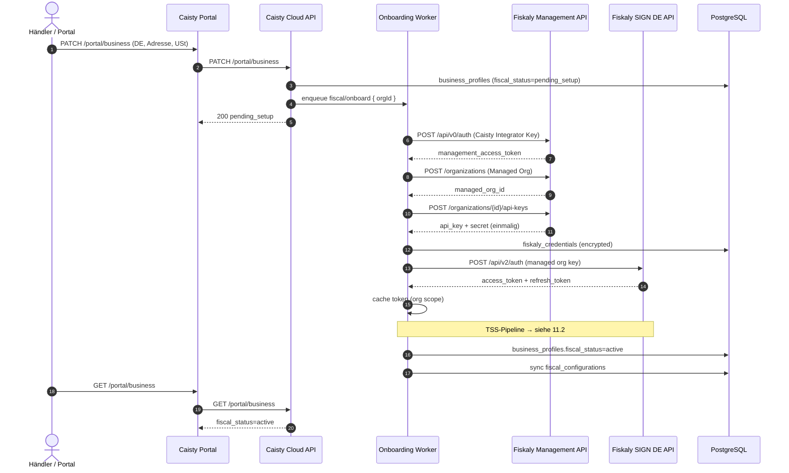
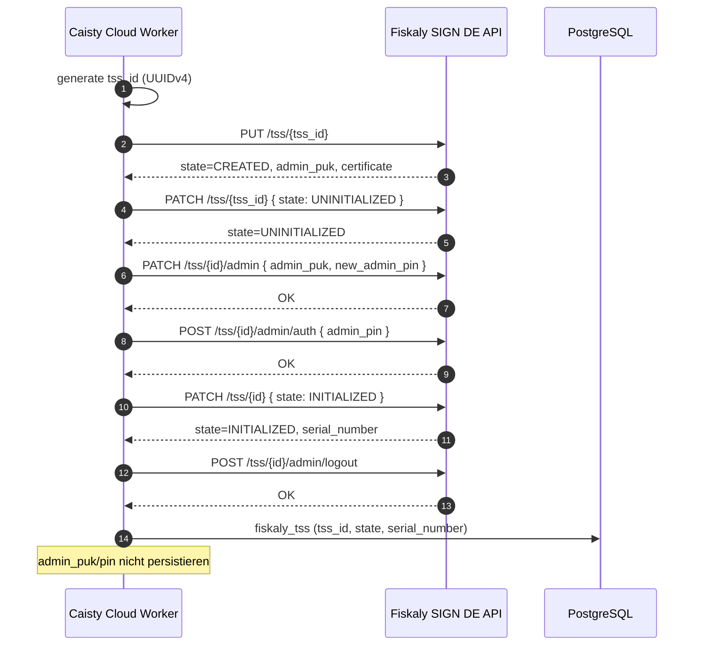
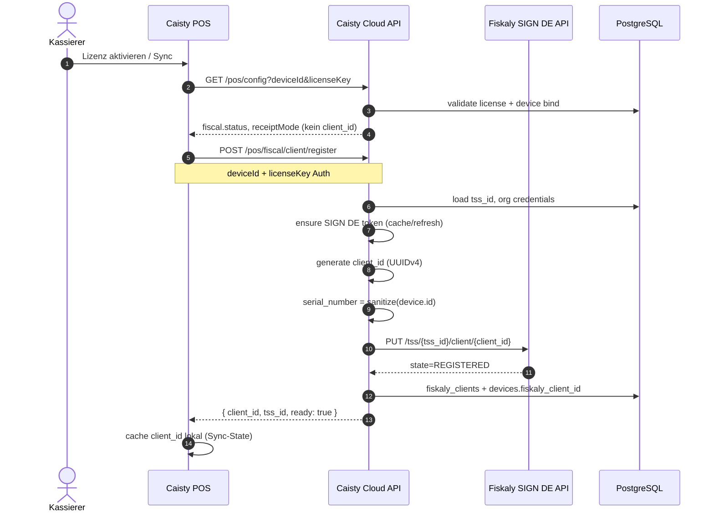
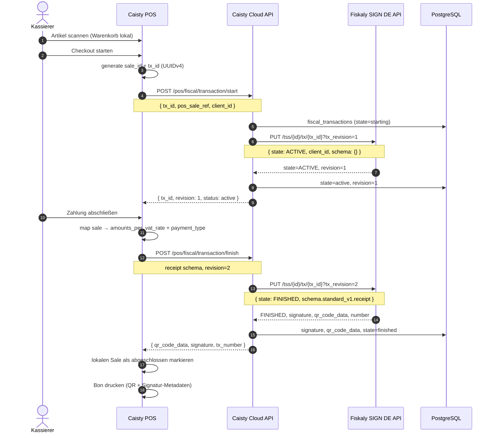
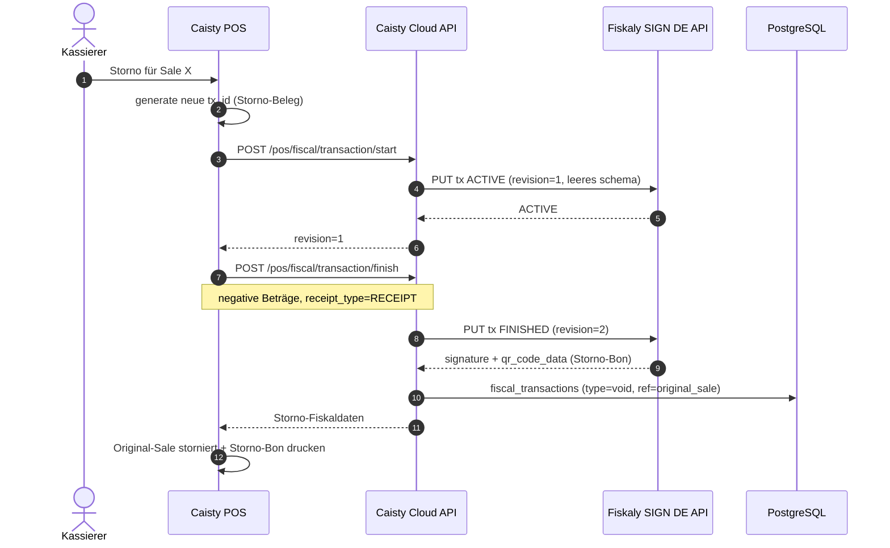
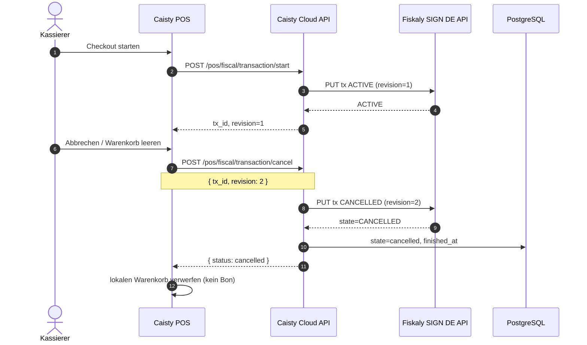
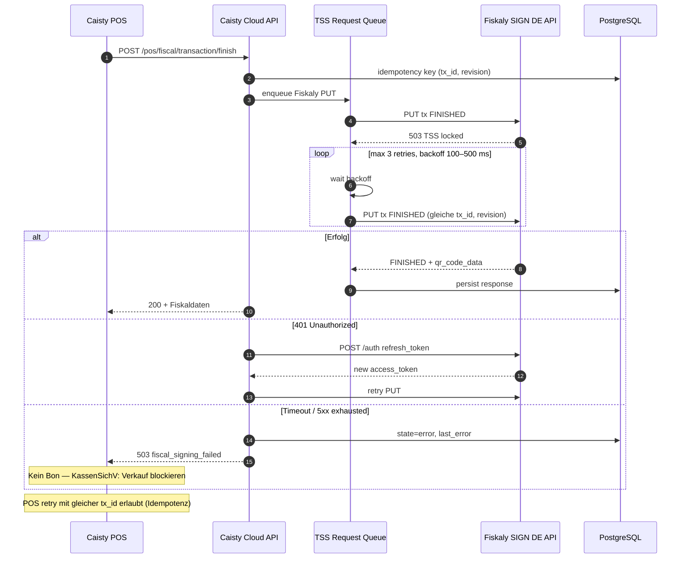
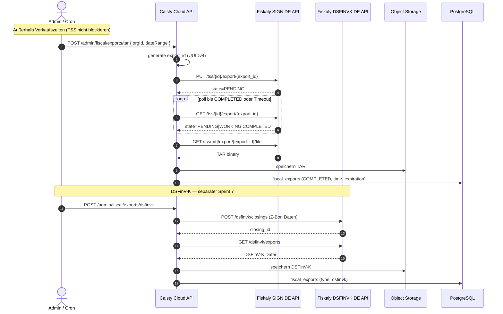
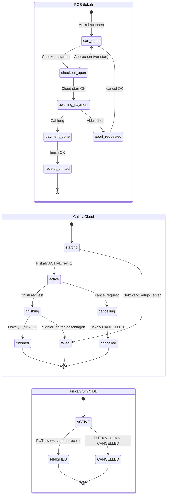

# Fiskaly SIGN DE — Technische Integrationsanalyse für Caisty Cloud

**Status:** Analyse / Architektur-Dokumentation  
**Datum:** Juli 2026  
**Scope:** Keine Implementierung — nur Analyse und Planung  
**Primärquellen (offizielle Fiskaly-Dokumentation):**

| Thema | URL |
|-------|-----|
| Einführung SIGN DE | https://workspace.fiskaly.com/countries/germany/introduction |
| Deutschland-Übersicht | https://workspace.fiskaly.com/countries/germany/ |
| Technische Details (TSS-Module) | https://workspace.fiskaly.com/countries/germany/technical-details |
| Step-by-Step Integration | https://workspace.fiskaly.com/countries/germany/integration-guide |
| Quickstart | https://workspace.fiskaly.com/countries/germany/quickstart |
| FAQ | https://workspace.fiskaly.com/countries/germany/faq |
| Core Concepts | https://workspace.fiskaly.com/getting-started/concepts |
| Authentication | https://workspace.fiskaly.com/reference/authentication |
| SIGN DE API Reference v2 | https://workspace.fiskaly.com/api/sign-de/ |

**Caisty-Ist-Stand (Referenz, nicht Teil der Fiskaly-Doku):** `FiskalyFiscalProvider` ist ein Placeholder; Credentials und TSS-Lifecycle sollen serverseitig in Caisty Cloud bleiben (`apps/cloud-api/src/fiscal/providers/FiskalyFiscalProvider.ts`).

---

## Inhaltsverzeichnis

1. [Architektur](#1-architektur)
2. [Lebenszyklus](#2-lebenszyklus)
3. [API-Übersicht](#3-api-übersicht)
4. [Datenmodell (Fiskaly)](#4-datenmodell-fiskaly)
5. [Mapping auf Caisty](#5-mapping-auf-caisty)
6. [Benötigte Cloud-Endpunkte (Analyse)](#6-benötigte-cloud-endpunkte-analyse)
7. [Datenbank (Analyse)](#7-datenbank-analyse)
8. [Fehlerfälle](#8-fehlerfälle)
9. [Best Practices (Fiskaly)](#9-best-practices-fiskaly)
10. [Offene Fragen](#10-offene-fragen)
11. [Sequenzdiagramme](#11-sequenzdiagramme)
12. [Transaction State Machine](#12-transaction-state-machine)
13. [Verantwortlichkeiten (POS / Cloud / Fiskaly)](#13-verantwortlichkeiten-pos--cloud--fiskaly)

**Implementierungsplan:** [FISKALY-IMPLEMENTATION-PLAN.md](./FISKALY-IMPLEMENTATION-PLAN.md)  
**API-Contract (POS ↔ Cloud):** [FISKALY-API-CONTRACT.md](./FISKALY-API-CONTRACT.md)

---

## 1. Architektur

### 1.1 Rechtlicher und fachlicher Kontext

**SIGN DE** ist Fiskalys spezialisierte API für die deutsche **KassenSichV** (Kassensicherungsverordnung). Ein ERS/PoS muss:

- relevante Geschäftsvorfälle **kryptografisch signieren** (TSS),
- **unveränderliche, prüfbare Aufzeichnungen** führen,
- **Exporte** für Betriebsprüfungen bereitstellen (TAR, DSFinV-K).

Fiskaly stellt eine **BSI-zertifizierte Cloud-TSS** bereit (laut Doku bis 2033 zertifiziert). Für Integratoren und Endkunden soll das System im Tagesgeschäft als **Black Box** behandelt werden: API-Aufrufe rein, Signatur + QR-Code raus.

Deutschland umfasst laut Fiskaly mehrere Produkte:

| Produkt | Zweck | Pflicht? |
|---------|-------|----------|
| **SIGN DE** | Transaktionssignierung via Cloud-TSS | Ja (KassenSichV) |
| **DSFINVK DE** | Audit-Exporte aus Kassenabschlüssen (DSFinV-K) | Ja (Betriebsprüfung) |
| **SUBMIT DE** | ELSTER-Meldungen | Ja (seit 2025) |
| **SAFE** | Langzeitarchivierung (10–30 Jahre) | Empfohlen |

Diese Analyse fokussiert **SIGN DE** (TSS/Client/Transaction/Export/TAR). DSFinV-K-Exporte und ELSTER sind **separate API-Oberflächen**, werden aber in Caisty bereits als `supportedExports: ["DSFinV-K", "TSE TAR"]` antizipiert.

### 1.2 Plattform-Hierarchie (Account → Transaction)

```
┌─────────────────────────────────────────────────────────────────┐
│  fiskaly HUB (hub.fiskaly.com)                                  │
│  Account (Integrator / Händler)                                 │
│    └── Group (z. B. pro Land / Marke)                           │
│          └── Managed Organization (= Unit / Standort)           │
│                └── SIGN DE Ressourcen                           │
│                      ├── API Key + Secret (pro Managed Org)     │
│                      ├── TSS (1+ pro Standort)                  │
│                      │     └── Client (1 pro Kasse/Terminal)    │
│                      │           └── Transaction → Receipt      │
│                      └── Export → TAR                           │
└─────────────────────────────────────────────────────────────────┘
```

**Management API** (`dashboard.fiskaly.com/api/v0/`) verwaltet Account, Groups, Managed Organizations und API Keys.  
**SIGN DE API v2** (`kassensichv-middleware.fiskaly.com/api/v2` TEST, `kassensichv.fiskaly.com/api/v2` LIVE) verwaltet TSS, Clients, Transactions und Exports.

### 1.3 Kernobjekte und Zusammenhänge

#### Account

- **Was:** Top-Level-Entität bei Registrierung auf dem fiskaly HUB; repräsentiert den POS-Anbieter oder Händler.
- **Beziehung:** Enthält eine oder mehrere **Groups**.
- **Caisty-Rolle:** Caisty als Integrator betreibt **einen** fiskaly-Account; Endkunden werden als **Managed Organizations** angelegt, nicht als eigene fiskaly-Accounts.

#### Group

- **Was:** Zwischenebene zur logischen Gruppierung von Managed Organizations (z. B. ein Group pro Land).
- **Beziehung:** Managed Organizations referenzieren `managed_by_organization_id` (= Group-ID).
- **Caisty-Rolle:** Vermutlich **eine Group „Caisty DE“** für alle deutschen Händler; alternative Aufteilung nach Region/Mandant später möglich.

#### Managed Organization (Unit)

- **Was:** Repräsentiert typischerweise **einen physischen Standort** (Filial, Restaurant). In SIGN DE entspricht dies dem Konzept **Unit** aus den Core Concepts.
- **Beziehung:** Gehört zu einer Group; erhält **eigenes API-Key-Paar** für SIGN DE.
- **Lebensdauer:** Persistent; steuert TEST/LIVE-Isolation über das jeweilige Key-Environment.
- **Caisty-Mapping:** 1:1 zu Caisty **`org`** / **`business_profiles`** (ein Händler-Standort).

#### API Key (+ Secret)

- **Was:** Zugangsdaten für JWT-Authentifizierung. Zwei Ebenen:
  1. **Account-API-Key** → Management API Token
  2. **Managed-Org-API-Key** → SIGN DE Token
- **Beziehung:** Secret wird **nur einmal** bei Erstellung angezeigt.
- **Caisty:** Nur in **Cloud-API Secrets** speichern; niemals an POS oder Portal senden.

#### Access Token (+ Refresh Token)

- **Was:** JWT für `Authorization: Bearer …`
- **Lebensdauer (SIGN DE):** Access Token **24 h**, Refresh Token **48 h** (laut Authentication Reference).
- **Beziehung:** Wird aus API Key + Secret via `POST /api/v2/auth` erzeugt; scoped auf `organization_id` der Managed Organization.
- **Caisty:** Token-Cache serverseitig pro Managed Org; Refresh bei 401.

#### TSS (Technical Security System / Cloud-TSS)

- **Was:** BSI-konforme Signaturkomponente. Besteht intern aus drei Modulen (laut Technical Details):
  - **Security Module:** SMA (SMAERS) + CSP — signiert Transaktionsdaten
  - **Storage Medium:** verteilte, verschlüsselte Speicherung (Google Cloud)
  - **Standard Digital Interface:** einheitliche Schnittstelle gemäß TR-03153
- **ID:** `tss_id` — **UUIDv4, vom Integrator generiert** (`PUT /tss/{tss_id}`).
- **States:** `CREATED` → `UNINITIALIZED` → `INITIALIZED` → optional `DISABLED` | `DEFECTIVE` | `EVICTED` | (TEST-only) `DELETED`
- **Beziehung:** Gehört zu einer Managed Organization (implizit über Token); hat viele **Clients**, **Transactions**, **Exports**.
- **Einschränkung:** TSS verarbeitet **nur eine Anfrage gleichzeitig**; bei hohem Durchsatz ggf. mehrere TSS pro Standort (FAQ).

#### Client

- **Was:** Repräsentiert **ein POS-Terminal / eine Kasse**.
- **ID:** `client_id` — **UUIDv4, vom Integrator generiert**.
- **Pflichtfeld:** `serial_number` (max. 70 Zeichen, DSFinV-K 2.3: kein `/` oder `_`; **nach Erstellung unveränderlich**).
- **States:** u. a. `REGISTERED`, `DEREGISTERED`
- **Beziehung:** Gehört zu genau **einer TSS**; erzeugt **Transactions**.
- **Caisty-Mapping:** 1:1 zu Caisty **`devices`** (POS-Gerät).

#### Transaction

- **Was:** Ein zu signierender Geschäftsvorfall (Kassenbeleg, Bestellung, Storno, etc.).
- **ID:** `tx_id` — **UUIDv4, vom Integrator generiert**; alternativ `tx_number` (von Fiskaly vergeben).
- **States:** `ACTIVE` → `FINISHED` oder `CANCELLED`
- **Revision:** Jeder PUT erfordert inkrementelles `tx_revision` (Query-Parameter).
- **Beziehung:** Gehört zu **TSS + Client**; beim Abschluss entsteht **Receipt-Daten** (Schema) + **Signatur** + **QR-Code**.
- **Limit:** Max. **2000 offene (`ACTIVE`) Transactions** pro TSS.

#### Receipt (im Transaction-Schema)

- **Was:** Kein separates REST-Objekt, sondern **Payload innerhalb der Transaction** beim Finish:
  - Schema `standard_v1.receipt` (Kassenbeleg-V1) für Retail
  - Schema `standard_v1.order` (Bestellung-V1) für Gastronomie (lange Vorgänge)
  - `receipt_type`: z. B. `RECEIPT`, Storno via negative Beträge
- **Beziehung:** Wird bei `state: FINISHED` übergeben; Antwort enthält Signatur + `qr_code_data`.

#### Export

- **Was:** Asynchroner Job zur Erzeugung einer **TAR-Datei** mit SMAERS-Initialisierung, signierten Log-Messages und Zertifikaten.
- **ID:** `export_id` — UUIDv4, vom Integrator generiert.
- **States:** `PENDING` → `WORKING` → `COMPLETED` | `CANCELLED` | Fehler
- **Beziehung:** Gehört zu einer **TSS**; Ergebnis abrufbar als **TAR file**.
- **Limits:** Max. **10** gleichzeitige Exports in `PENDING`/`WORKING` pro TSS; Export kann **TSS-Signierung blockieren**.

#### TAR (Transaktionsarchiv)

- **Was:** POSIX-TAR-Archiv mit TSS-Protokolldaten (nicht identisch mit DSFinV-K-Datei).
- **Beziehung:** Ergebnis eines abgeschlossenen **Export**-Jobs (`GET …/export/{export_id}/file`).
- **Verfügbarkeit:** Bis `time_expiration`, danach permanent gelöscht.

#### DSFinV-K

- **Was:** Standardisiertes **Prüfdatenformat** der Finanzverwaltung für Kassensysteme — **separates Produkt DSFINVK DE**, nicht identisch mit SIGN-DE-TAR-Export.
- **Beziehung:** Basiert auf Kassenabschlüssen (Cash Point Closings) und Transaktionsdaten; laut Germany-Overview: `POST /dsfinvk/closings`, `GET /dsfinvk/exports`.
- **Caisty:** In `supported_exports` bereits genannt; Implementierung separater API-Phase.

#### QR-Code (`qr_code_data`)

- **Was:** Semikolon-separierter String auf dem Bon (KassenSichV-konform), z. B.:
  ```
  V0;955002-00;Kassenbeleg-V1;Beleg^0.00_2.55_...;…;signature;publicKey
  ```
- **Beziehung:** Wird in der **FINISHED Transaction Response** geliefert; validierbar via **fiskalcheck** App (FAQ).
- **Caisty:** POS druckt QR auf Bon; Cloud speichert `qr_code_data` + Signatur-Metadaten optional mit.

### 1.4 Umgebungen (TEST vs LIVE)

| Environment | SIGN DE Base URL | Daten |
|-------------|------------------|-------|
| TEST | `https://kassensichv-middleware.fiskaly.com/api/v2` | Simuliert, keine Behördenübermittlung |
| LIVE | `https://kassensichv.fiskaly.com/api/v2` | Rechtlich bindend |

TEST und LIVE sind **vollständig isoliert**. API Keys aus TEST erzeugen nur TEST-Ressourcen. Caisty `fiscal_environment` (`sandbox` / `live`) mappt hierauf.

### 1.5 Empfohlene Caisty-Integrationsarchitektur

```
┌──────────────┐     ┌─────────────────┐     ┌──────────────────┐
│ Caisty POS   │────▶│ Caisty Cloud API │────▶│ Fiskaly SIGN DE  │
│ (kein Secret)│     │ (Credentials,    │     │ (TSS/Client/Tx)  │
│              │◀────│  Token-Cache)    │◀────│                  │
└──────────────┘     └─────────────────┘     └──────────────────┘
        │                      │
        │                      ├── Management API (Onboarding)
        │                      └── DSFINVK DE (später)
        ▼
   Bon mit QR-Code
   (qr_code_data aus Cloud-Response)
```

Entspricht dem bestehenden Caisty-Prinzip: **API-Service-Provider**, keine Fiskaly-Credentials auf dem POS.

---

## 2. Lebenszyklus

### 2.1 Provisioning (einmalig pro Standort / Kasse)

| Schritt | Aktion | API / UI | Ergebnis |
|---------|--------|----------|----------|
| 1 | Caisty-Händler speichert Business Profile | Caisty `PATCH /portal/business` | `business_profiles` vollständig (DE) |
| 2 | Cloud startet Fiskaly-Onboarding | Caisty (geplant) `POST /fiscal/register` | Trigger |
| 3 | Managed Organization anlegen | Management API `POST /organizations` | `fiskaly_org_id` |
| 4 | API Key für Managed Org | Management API `POST /organizations/{id}/api-keys` | Key + Secret (einmalig) |
| 5 | SIGN DE Token holen | `POST /api/v2/auth` | `access_token` |
| 6 | TSS erstellen | `PUT /api/v2/tss/{tss_id}` | State `CREATED`, `admin_puk` |
| 7 | TSS personalisieren | `PATCH /tss/{id}` → `UNINITIALIZED` | |
| 8 | Admin PIN setzen | `PATCH /tss/{id}/admin` | Neuer Admin PIN |
| 9 | Admin authentifizieren | `POST /tss/{id}/admin/auth` | Admin-Session |
| 10 | TSS initialisieren | `PATCH /tss/{id}` → `INITIALIZED` | TSS betriebsbereit |
| 11 | Admin logout | `POST /tss/{id}/admin/logout` | Best Practice |
| 12 | Client pro POS | `PUT /tss/{id}/client/{client_id}` | State `REGISTERED` |
| 13 | Caisty speichert IDs | DB | `tss_id`, `client_id`, Status `active` |
| 14 | POS Sync | Caisty `GET /pos/config` | Fiscal-Config an POS |

**FAQ-Empfehlung:** Pro **Standort** eine Managed Organization; pro **Standort** mindestens eine TSS; pro **Kasse** ein Client.

### 2.2 Tagesgeschäft (Checkout)

```
Kunde scannt Artikel          Verkauf läuft              Zahlung abgeschlossen
        │                           │                            │
        ▼                           ▼                            ▼
  PUT tx (ACTIVE)            PUT tx (ACTIVE)              PUT tx (FINISHED)
  tx_revision=1              tx_revision=2..n             tx_revision=n+1
  schema: leer               schema: optional             schema: receipt/order
        │                           │                            │
        └───────────────────────────┴────────────────────────────┘
                                    │
                                    ▼
                          Response: signature,
                          qr_code_data, tx_number
                                    │
                                    ▼
                              Bon drucken
```

| Phase | Fiskaly | POS/Caisty |
|-------|---------|------------|
| Warenkorb öffnen | `state: ACTIVE`, leeres Schema, `tx_revision=1` | Cloud oder POS generiert `tx_id` (UUIDv4) |
| Positionen ändern | Optional weitere `ACTIVE`-Updates, Revision++ | Warenkorb lokal; Schema bei Updates optional |
| Zahlung | `state: FINISHED`, vollständiges `standard_v1.receipt` | Beträge nach USt-Satz + Zahlungsart |
| Storno / Abbruch | `state: CANCELLED` | Bei abgebrochenem Vorgang |
| Bon | — | QR aus `qr_code_data` drucken; Signatur metadata speichern |

### 2.3 Export / Audit

| Phase | Aktion |
|-------|--------|
| Kassenabschluss (Z-Bon) | Caisty erfasst Closing lokal |
| TAR-Export (TSE-Protokoll) | `PUT /tss/{id}/export/{export_id}` → poll `GET export` → `GET export/.../file` |
| DSFinV-K | DSFINVK DE API (separate Phase) |
| Archivierung | Optional SAFE |

**Warnung (Fiskaly):** Exporte außerhalb der Geschäftszeiten / ohne parallele Signierung ausführen.

---

## 3. API-Übersicht

### 3.1 Base URLs

| API | TEST | LIVE |
|-----|------|------|
| Management API v0 | `https://dashboard.fiskaly.com/api/v0/` | gleich |
| SIGN DE v2 | `https://kassensichv-middleware.fiskaly.com/api/v2` | `https://kassensichv.fiskaly.com/api/v2` |

### 3.2 Management API (Onboarding)

| Methode | URL | Zweck | Request (Kern) | Response (Kern) | Pflicht | Caisty-Nutzung |
|---------|-----|-------|----------------|-----------------|---------|----------------|
| POST | `/auth` | Management Token | `{ api_key, api_secret }` | `access_token`, `refresh_token`, `access_token_claims.organization_id` | Ja | Caisty-Integrator-Account; Onboarding-Job |
| POST | `/organizations` | Managed Org anlegen | `{ name, managed_by_organization_id, address…, country_code: "DEU" }` | `{ _id, name, state, … }` | Ja | Pro Caisty-`org` / Standort |
| POST | `/organizations/{ORG_ID}/api-keys` | Org-scoped API Key | `{ name, status: "enabled", managed_by_organization_id }` | `{ key, secret, _envs }` | Ja | Secret einmalig in Vault |

*Hinweis: Management Token-Lifetime laut Integration Guide ~300 s — für lange Jobs Refresh beachten.*

### 3.3 SIGN DE — Authentication

| Methode | URL | Zweck | Request | Response | Pflicht | Caisty |
|---------|-----|-------|---------|----------|---------|--------|
| POST | `/auth` | Access Token | `{ api_key, api_secret }` | `access_token` (24h), `refresh_token` (48h), `access_token_claims` | Ja | Pro Managed Org; Cache |
| POST | `/auth` | Token Refresh | `{ refresh_token }` | Neue Tokens | Bei 401 | Automatischer Refresh |

### 3.4 SIGN DE — TSS

| Methode | URL | Zweck | Request (Kern) | Response (Kern) | Pflicht | Caisty |
|---------|-----|-------|----------------|-----------------|---------|--------|
| PUT | `/tss/{tss_id}` | TSS erstellen | `{ metadata?, description? }` | `state: CREATED`, `admin_puk`, `certificate`, `serial_number` | Ja (Onboarding) | UUIDv4 selbst generieren; Timeout ≥ 30 s |
| GET | `/tss/{tss_id}` | TSS abrufen | — | TSS-Objekt inkl. `state` | Optional | Health/Status |
| PATCH | `/tss/{tss_id}` | State ändern | `{ state: UNINITIALIZED \| INITIALIZED \| DISABLED }` | Aktualisiertes TSS | Ja (Init) | Setup-Pipeline |
| PATCH | `/tss/{tss_id}/admin` | Admin PIN | `{ admin_puk, new_admin_pin }` | OK | Ja (Init) | Server-side only |
| POST | `/tss/{tss_id}/admin/auth` | Admin login | `{ admin_pin }` | OK | Ja (Init) | Vor INITIALIZED |
| POST | `/tss/{tss_id}/admin/logout` | Admin logout | — | OK | Empfohlen | Nach Init |
| GET | `/tss` | TSS listen | Query: states, limit, offset | Liste | Optional | Admin/Support |
| GET/PATCH | `/tss/{tss_id}/metadata` | Metadaten | Key-Value (≤20 keys) | Metadata | Optional | Caisty org_id verknüpfen |

### 3.5 SIGN DE — Client

| Methode | URL | Zweck | Request (Kern) | Response (Kern) | Pflicht | Caisty |
|---------|-----|-------|----------------|-----------------|---------|--------|
| PUT | `/tss/{tss_id}/client/{client_id}` | Client anlegen | `{ serial_number }` | `state: REGISTERED`, `tss_id` | Ja | Bei Device-Bindung |
| GET | `/tss/{tss_id}/client/{client_id}` | Client abrufen | — | Client | Optional | Diagnose |
| PATCH | `/tss/{tss_id}/client/{client_id}` | Client update | `{ state: DEREGISTERED }` | Client | Bei Gerätewechsel | Device-Replace |
| GET | `/tss/{tss_id}/client` | Clients listen | — | Liste | Optional | Admin |
| GET | `/client` | Alle Clients | — | Liste | Optional | Support |

*TSS muss `UNINITIALIZED` oder `INITIALIZED` sein (FAQ). `serial_number` max. 70 Zeichen, kein `/` oder `_`.*

### 3.6 SIGN DE — Transaction

| Methode | URL | Zweck | Request (Kern) | Response (Kern) | Pflicht | Caisty |
|---------|-----|-------|----------------|-----------------|---------|--------|
| PUT | `/tss/{tss_id}/tx/{tx_id}?tx_revision=N` | Start/Update/Finish | `{ state, client_id, schema?, metadata? }` | Transaction + ggf. `signature`, `qr_code_data` | Ja | Kern-Checkout |
| GET | `/tss/{tss_id}/tx/{tx_id}` | Transaction lesen | `?tx_revision=` optional | Transaction | Optional | Reconciliation |
| GET | `/tss/{tss_id}/tx` | Transactions listen | Filter: states, dates | Liste | Optional | Admin/Audit |
| GET | `/tx` | Global listen | Filter | Liste | Optional | Support |

**Transaction States:**

| state | schema bei Start | schema bei Finish |
|-------|------------------|-------------------|
| `ACTIVE` | **leer** (DSFinV-K Pflicht) | — |
| `ACTIVE` (Update) | optional | — |
| `FINISHED` | — | `standard_v1.receipt` oder `order` |
| `CANCELLED` | — | — |

**Finish-Response-Felder (relevant für Bon):** `signature.value`, `signature.counter`, `signature.timestamp`, `qr_code_data`, `number`, `time_start`, `time_end`.

### 3.7 SIGN DE — Export / TAR

| Methode | URL | Zweck | Request | Response | Caisty |
|---------|-----|-------|---------|----------|--------|
| PUT | `/tss/{tss_id}/export/{export_id}` | Export starten | Query: date range, signature counters, `client_id`, … | Export `PENDING` | Admin/Scheduled Job |
| GET | `/tss/{tss_id}/export/{export_id}` | Status poll | — | `state`, `time_expiration` | Poll bis `COMPLETED` |
| GET | `/tss/{tss_id}/export/{export_id}/file` | TAR download | — | Binary TAR | Speicherung / Download Portal |
| DELETE | `/tss/{tss_id}/export/{export_id}` | Export abbrechen | — | Export | Optional |
| GET | `/tss/{tss_id}/export` | Exports listen | — | Liste | Admin |

### 3.8 DSFINVK DE (separate Phase, Kurzüberblick)

Laut Germany-Overview (nicht vollständig in dieser Analyse):

| Methode | URL | Zweck |
|---------|-----|-------|
| POST | `/dsfinvk/closings` | Kassenabschluss übermitteln |
| GET | `/dsfinvk/exports` | DSFinV-K-Exportdatei erzeugen |

Caisty: eigene Endpunkt-Gruppe `/fiscal/exports/dsfinvk/*` in späterer Phase.

---

## 4. Datenmodell (Fiskaly)

### 4.1 Managed Organization

| Attribut | Typ | Beschreibung |
|----------|-----|--------------|
| `_id` | UUID | Managed Organization ID |
| `name` | string | Standortname |
| `managed_by_organization_id` | UUID | Group ID |
| `address_line1`, `zip`, `town`, `country_code` | string | Adresse |
| `state` | string | z. B. `active` |
| `time_creation` | ISO datetime | Erstellzeit |

**Lebensdauer:** Persistent (LIVE rechtlich relevant).  
**Beziehungen:** 1 → n TSS; 1 → 1 API-Key-Set pro Environment.

### 4.2 TSS

| Attribut | Typ | Beschreibung |
|----------|-----|--------------|
| `_id` / `tss_id` | UUIDv4 | Integrator-generiert |
| `state` | enum | CREATED, UNINITIALIZED, INITIALIZED, DISABLED, DEFECTIVE, EVICTED, DELETED |
| `serial_number` | string | TSE-Seriennummer |
| `certificate` | PEM | BSI-Zertifikat |
| `public_key` | string | Verifikation |
| `signature_algorithm` | string | z. B. ECDSA |
| `admin_puk` | string | Nur bei CREATED sichtbar |
| `max_number_registered_clients` | int | z. B. 100 |
| `max_number_active_transactions` | int | z. B. 1000 (Limit offen: 2000 laut API-Text) |
| `metadata` | object | ≤20 custom keys |
| `time_creation` | unix/ISO | |

**Lebensdauer:** Persistent bis DISABLED/DEFECTIVE; TEST: Auto-DELETE Sundays.  
**Beziehungen:** 1 TSS → n Clients, n Transactions, n Exports.

### 4.3 Client

| Attribut | Typ | Beschreibung |
|----------|-----|--------------|
| `_id` / `client_id` | UUIDv4 | Integrator-generiert |
| `tss_id` | UUID | Parent TSS |
| `serial_number` | string | POS-ID (permanent, max 70) |
| `state` | enum | REGISTERED, DEREGISTERED |
| `time_creation` | datetime | |

**Lebensdauer:** Persistent; bei Hardwarewechsel DEREGISTERED + neuer Client.

### 4.4 Transaction

| Attribut | Typ | Beschreibung |
|----------|-----|--------------|
| `_id` / `tx_id` | UUIDv4 | Integrator-generiert |
| `number` | int | Fiskaly-interne Nummer |
| `state` | enum | ACTIVE, FINISHED, CANCELLED |
| `revision` / `latest_revision` | int | Optimistic concurrency |
| `client_id` | UUID | |
| `tss_id` | UUID | |
| `time_start`, `time_end` | unix | |
| `schema` | object | standard_v1 / dsfinvtw_v1 / raw |
| `signature` | object | value, algorithm, counter, public_key, timestamp |
| `qr_code_data` | string | Bon-QR (nur FINISHED) |
| `metadata` | object | Custom keys |

**Lebensdauer:** Immutable nach FINISHED/CANCELLED (Revisionen historisch abrufbar).

### 4.5 Export

| Attribut | Typ | Beschreibung |
|----------|-----|--------------|
| `_id` / `export_id` | UUIDv4 | Integrator-generiert |
| `tss_id` | UUID | |
| `state` | enum | PENDING, WORKING, COMPLETED, CANCELLED, ERROR |
| `time_request`, `time_completion`, `time_expiration` | unix | |
| `exception` | string | Fehlerinfo |

**Lebensdauer:** TAR bis `time_expiration`, dann gelöscht.

### 4.6 Receipt Schema (`standard_v1.receipt`)

| Feld | Beschreibung |
|------|--------------|
| `receipt_type` | RECEIPT, TRAINING, TRANSFER, … |
| `amounts_per_vat_rate[]` | `{ vat_rate: NORMAL\|REDUCED_1\|…, amount: "10.00" }` |
| `amounts_per_payment_type[]` | `{ payment_type: CASH\|NON_CASH\|…, amount, currency_code? }` |

Beträge als **String-Dezimal** (UTF-8).

---

## 5. Mapping auf Caisty

### 5.1 Entitäts-Mapping

| Fiskaly | Caisty (heute) | Caisty (geplant) | Anmerkung |
|---------|----------------|------------------|-----------|
| Account / Group | — | Caisty-Integrator-Konfig (Env) | Ein fiskaly-Account für Caisty |
| Managed Organization | `orgs` + `business_profiles` | + `fiskaly_managed_org_id` | Adresse, USt-ID aus Portal |
| API Key / Secret | — | Secrets Vault / `fiskaly_credentials` | Niemals an POS |
| Access Token | — | In-Memory Cache pro Org | 24h/48h Refresh |
| TSS | — | `fiskaly_tss` Tabelle | 1+ pro Standort |
| Client | `devices` | + `fiskaly_client_id` | Bei `devices/bind` |
| Transaction | POS lokaler Sale | + `fiscal_transactions` | Cloud proxyt Signing |
| Receipt / QR | POS Receipt Print | Signatur-Felder in Response | `qr_code_data` an POS |
| Export / TAR | — | `fiscal_exports` | Admin/Portal Download |
| DSFinV-K | `supported_exports` Config | DSFINVK DE Phase 2 | Separates Produkt |

### 5.2 Status-Mapping

| Caisty `fiscal_status` | Fiskaly-Zustand |
|------------------------|-----------------|
| `not_required` | Kein DE / provider `none` |
| `pending_setup` | Managed Org oder TSS/Client noch nicht INITIALIZED |
| `active` | TSS `INITIALIZED`, Client `REGISTERED`, min. 1 Test-Tx optional |
| `error` | TSS `DEFECTIVE`, Auth-Fehler, Setup abgebrochen |

| Caisty `fiscal_environment` | Fiskaly |
|-------------------------------|---------|
| `sandbox` | TEST (`kassensichv-middleware…`) |
| `live` | LIVE (`kassensichv…`) |
| `not_configured` | Noch kein Key/Org |

### 5.3 Bestehende Caisty-Komponenten (Ist)

| Komponente | Pfad | Rolle bei Fiskaly |
|------------|------|-------------------|
| `business_profiles` | `apps/cloud-api/src/db/schema/businessProfiles.ts` | Input für Managed Org (Name, Adresse, USt) |
| `fiscal_configurations` | `…/fiscalConfigurations.ts` | Denormalisierte Anzeige / POS-Sync |
| `FiskalyFiscalProvider` | `…/fiscal/providers/FiskalyFiscalProvider.ts` | `startSetup()` → echte Pipeline |
| `registerPortalBusinessRoutes` | `…/routes/portal-business.ts` | Trigger Onboarding bei DE-PATCH |
| `registerPosConfigRoutes` | `…/routes/pos-config.ts` | Liefert `fiscal.status`, `receiptMode` — später + `client_id` |
| `registerAdminFiscalRoutes` | `…/routes/admin/fiscal.ts` | Overview; `startSetup` Action Flag |
| Admin UI | `apps/cloud-admin/…/FiscalCompliancePage.tsx` | Setup-Buttons (derzeit disabled) |
| Portal UI | `apps/caisty-site/…/PortalBusinessPage.tsx` | Business + Fiscal-Anzeige |
| POS | Caisty-Pos (extern) | Ruft künftig Caisty Cloud für Signing auf |

### 5.4 Datenfluss (Soll)

```
Portal PATCH business (DE)
    → business_profiles.fiscal_status = pending_setup
    → FiskalyFiscalProvider.startSetup()
        → Management API: createOrganization
        → createApiKey → store secret
        → SIGN DE: create TSS → init → create Client(s)
    → fiscal_configurations sync
    → fiscal_status = active

POS Sale
    → POST Caisty /fiscal/transaction/start (device auth)
        → Fiskaly PUT tx ACTIVE
    → POST …/finish
        → Fiskaly PUT tx FINISHED
        → return qr_code_data + signature to POS
    → POS prints receipt
```

---

## 6. Benötigte Cloud-Endpunkte (Analyse)

> **Nicht implementieren** — nur Architekturvorschlag. Pfade orientieren sich an Caisty-Konventionen (`/portal/*`, `/pos/*`, `/admin/*`).

### 6.1 Onboarding & Konfiguration

| Endpunkt | Methode | Auth | Zweck |
|----------|---------|------|-------|
| `/admin/fiscal/customers/:customerId/setup` | POST | Admin JWT | Manueller/trigger Onboarding (Managed Org + TSS) |
| `/portal/business/fiscal/setup` | POST | Portal JWT | Self-Service Start (optional) |
| `/internal/fiscal/onboard/:orgId` | POST | Internal/Queue | Async Setup-Worker |
| `/admin/fiscal/customers/:customerId/status` | GET | Admin JWT | Detaillierter Fiskaly-Status (TSS state, Clients) |
| `/portal/business/fiscal/status` | GET | Portal JWT | Kunden-sichtbarer Setup-Fortschritt |
| `/pos/fiscal/config` | GET | Device + License | Erweitert `/pos/config`: `tss_id`, `client_id`, `receipt_mode` (ohne Secrets) |

### 6.2 Device / Client Lifecycle

| Endpunkt | Methode | Auth | Zweck |
|----------|---------|------|-------|
| `/pos/fiscal/client/register` | POST | Device + License | Fiskaly Client anlegen bei erstem Bind |
| `/admin/fiscal/devices/:deviceId/reregister` | POST | Admin JWT | Client DEREGISTERED + neu |

### 6.3 Transaction Proxy (Kern)

| Endpunkt | Methode | Auth | Zweck |
|----------|---------|------|-------|
| `/pos/fiscal/transaction/start` | POST | Device + License | Fiskaly `ACTIVE`, tx_revision=1 |
| `/pos/fiscal/transaction/update` | POST | Device + License | Fiskaly `ACTIVE`, revision++ |
| `/pos/fiscal/transaction/finish` | POST | Device + License | Fiskaly `FINISHED` + Receipt-Schema |
| `/pos/fiscal/transaction/cancel` | POST | Device + License | Fiskaly `CANCELLED` |
| `/pos/fiscal/transaction/:txId` | GET | Device + License | Status/Reconciliation |

**Alternative:** Ein generischer `PUT`-Proxy `/pos/fiscal/transaction` mit `{ action, tx_id, revision, payload }` — näher an Fiskaly, aber weniger REST-idiomatisch für POS.

### 6.4 Export & Audit

| Endpunkt | Methode | Auth | Zweck |
|----------|---------|------|-------|
| `/admin/fiscal/exports/tar` | POST | Admin JWT | TAR-Export triggern |
| `/admin/fiscal/exports/:exportId` | GET | Admin JWT | Status + Download-URL |
| `/portal/fiscal/exports` | GET | Portal JWT | Export-Liste für Händler |
| `/admin/fiscal/exports/dsfinvk` | POST | Admin JWT | DSFINVK DE (Phase 2) |

### 6.5 Webhooks / Jobs (optional)

| Endpunkt | Methode | Zweck |
|----------|---------|-------|
| `/internal/fiscal/export/poll` | POST | Cron: Export-Status aktualisieren |
| `/internal/fiscal/token/refresh` | POST | Proaktiver Token-Refresh |

---

## 7. Datenbank (Analyse)

### 7.1 Erweiterbare bestehende Tabellen

| Tabelle | Erweiterung | Gespeicherte IDs / Felder |
|---------|-------------|---------------------------|
| `business_profiles` | Fiskaly-Referenz | `fiskaly_managed_org_id`, Setup-Timestamp, `fiskaly_setup_error` |
| `business_profiles` | Environment | `fiscal_environment` → `sandbox`/`live` (bereits vorhanden, derzeit ungenutzt) |
| `fiscal_configurations` | Runtime-Status | `fiskaly_tss_state`, `fiskaly_client_count`, `last_transaction_at` |
| `devices` | Client-Mapping | `fiskaly_client_id`, `fiskaly_client_serial`, `fiskaly_registered_at` |

### 7.2 Vermutlich neue Tabellen

#### `fiskaly_credentials`

| Spalte | Typ | Beschreibung |
|--------|-----|--------------|
| `id` | UUID PK | |
| `org_id` | UUID FK | Caisty org |
| `managed_org_id` | string | Fiskaly `_id` |
| `api_key_id` | string | |
| `api_key_encrypted` | text | Verschlüsselt |
| `api_secret_encrypted` | text | Verschlüsselt |
| `environment` | enum | TEST, LIVE |
| `created_at` | timestamptz | |

#### `fiskaly_tss`

| Spalte | Typ | Beschreibung |
|--------|-----|--------------|
| `id` | UUID PK | |
| `org_id` | UUID FK | |
| `tss_id` | UUID | Fiskaly TSS ID (client-generated) |
| `state` | string | INITIALIZED, DISABLED, … |
| `serial_number` | string | TSE-Seriennummer |
| `admin_pin_set` | boolean | PIN konfiguriert (PIN selbst **nicht** speichern) |
| `environment` | enum | |
| `metadata` | jsonb | |
| `created_at`, `updated_at` | timestamptz | |

#### `fiskaly_clients`

| Spalte | Typ | Beschreibung |
|--------|-----|--------------|
| `id` | UUID PK | |
| `device_id` | UUID FK | Caisty device |
| `tss_id` | UUID FK | |
| `client_id` | UUID | Fiskaly client ID |
| `serial_number` | string | |
| `state` | string | REGISTERED / DEREGISTERED |
| `created_at` | timestamptz | |

#### `fiscal_transactions`

| Spalte | Typ | Beschreibung |
|--------|-----|--------------|
| `id` | UUID PK | |
| `org_id` | UUID FK | |
| `device_id` | UUID FK | |
| `fiskaly_tx_id` | UUID | |
| `fiskaly_tx_number` | bigint | optional |
| `tss_id`, `client_id` | UUID | |
| `state` | enum | ACTIVE, FINISHED, CANCELLED |
| `revision` | int | Letzte tx_revision |
| `pos_sale_ref` | string | Lokale POS-Referenz |
| `signature_value` | text | |
| `signature_counter` | string | |
| `qr_code_data` | text | |
| `finished_at` | timestamptz | |
| `request_payload_hash` | string | Idempotenz / Audit |

#### `fiscal_exports`

| Spalte | Typ | Beschreibung |
|--------|-----|--------------|
| `id` | UUID PK | |
| `org_id`, `tss_id` | UUID | |
| `export_id` | UUID | Fiskaly export ID |
| `state` | string | |
| `storage_path` | string | TAR nach Download |
| `time_expiration` | timestamptz | |
| `created_at` | timestamptz | |

### 7.3 Dauerhaft zu speichernde IDs (Pflicht)

| ID | Grund |
|----|-------|
| `managed_org_id` | Auth-Scope, Org-Zuordnung |
| `tss_id` | Alle Tx/Export-Calls |
| `client_id` | Jede Transaction |
| `tx_id` | Idempotenz, Storno, Audit |
| `export_id` | TAR-Abruf |
| `fiskaly_tx_number` | Support / DSFinV-K Cross-Ref |

**Nicht speichern:** API Secrets im Klartext, Admin PUK/PIN, Refresh Tokens dauerhaft (nur Cache).

---

## 8. Fehlerfälle

### 8.1 Authentifizierung

| Fehler | HTTP | Ursache | Caisty-Strategie |
|--------|------|---------|------------------|
| Token abgelaufen | 401 | Access Token > 24h | Refresh Token; bei Fail Re-Auth mit API Secret |
| Ungültige Credentials | 401 | Key/Secret falsch | Alert Admin; `fiscal_status=error` |
| Falsche Organization | 403 | JWT org ≠ Request | Mapping-Bug prüfen |

### 8.2 TSS

| Fehler | Code/HTTP | Ursache | Strategie |
|--------|-----------|---------|-----------|
| TSS locked | 423 / 503 | Parallele Requests / Export läuft | Retry mit Backoff (100–500 ms) |
| TSS not INITIALIZED | 400 | Setup unvollständig | Block POS; zeige Setup-Hinweis |
| TSS DEFECTIVE | — | Hardware/Cloud-Fehler | Support-Eskalation; ggf. neue TSS |
| TSS DELETED (TEST) | E_TSS_DELETED | TEST-Cleanup Sonntag | Re-Provisioning in TEST |
| Eviction (inaktiv) | EVICTED | 30 Tage ungenutzt (Doku) | Re-Init Pipeline |

### 8.3 Client

| Fehler | Ursache | Strategie |
|--------|---------|-----------|
| Client unbekannt | 404 | Client neu registrieren |
| TSS wrong state | Client creation blocked | TSS-Status prüfen |
| serial_number invalid | DSFinV-K Regeln | Validierung vor PUT |

### 8.4 Transaction

| Fehler | Ursache | Strategie |
|--------|---------|-----------|
| tx_revision mismatch | Concurrent update | Revision aus GET laden, retry |
| Transaction already FINISHED | Doppelter Finish | Idempotent: gespeicherte Response zurückgeben |
| 2000 ACTIVE limit | Offene Tx nicht geschlossen | Auto-Cancel Job / Admin-Tool |
| Schema validation | Falsche USt/Payment | POS-Validierung vor Cloud-Call |

### 8.5 Netzwerk

| Szenario | Strategie |
|----------|-----------|
| Timeout bei TSS-Erstellung | Timeout ≥ 30 s; Retry idempotent (UUID fix) |
| Timeout bei Signierung | POS: Offline-Modus? (Caisty-Entscheidung — KassenSichV verbietet unsigned) |
| Intermittierende 5xx | Exponential Backoff, max 3 Versuche |
| Export poll | `Retry-After: 60` Header beachten |

### 8.6 Idempotenz (Caisty-Empfehlung)

- **`tx_id`**, **`tss_id`**, **`client_id`**, **`export_id`**: UUIDv4 client-/server-seitig vorab vergeben → PUT idempotent.
- **`tx_revision`**: strikt monoton pro Transaction.
- Cloud speichert `(fiskaly_tx_id, revision) → response` für Deduplizierung.

---

## 9. Best Practices (Fiskaly)

### 9.1 Token Handling

1. **Einmal authentifizieren**, Token im Speicher cachen.
2. **Nicht** bei jeder Transaction neu authentifizieren (~100 ms Overhead).
3. Bei **401**: Refresh Token → bei Fail Re-Auth.
4. Secrets nur in **Secrets Manager / Env**, nie im Client, nie in Git.
5. API Keys rotieren bei Kompromittierung.

### 9.2 Performance

| Operation | Limit (laut API-Übersicht) | Empfehlung |
|-----------|---------------------------|------------|
| Authentication | 10 req/min | Cache |
| Transaction signing | 200 req/min | Ausreichend für Checkout |
| Export | niedriger | Nachts / nach Closing |
| TSS-Erstellung | bis 30 s | Async Job + UI-Spinner |

**TSS-Serialisierung:** Nur 1 Request gleichzeitig pro TSS — bei Multi-Kasse ggf. **Queue pro TSS** in Caisty Cloud.

### 9.3 Idempotenz

- UUIDv4 für `tss_id`, `client_id`, `tx_id`, `export_id` selbst generieren (API Reference).
- Gleiche PUT-Requests mit gleicher ID sind idempotent.

### 9.4 QR-Code & Signatur

- QR-String **unverändert** auf Bon drucken (`qr_code_data` aus Response).
- Validierung via **fiskalcheck** App möglich (FAQ).
- Signatur-Felder (`value`, `counter`, `timestamp`, `algorithm`) für Archiv/Reprint speichern.

### 9.5 Sicherheit

- Admin PIN nach TSS-Init setzen; **Admin logout** durchführen.
- Admin PUK nur transient während Setup — **nicht persistieren** nach State-Wechsel.
- TLS 1.2+ (Cloud-TSS Standard).
- TEST vor LIVE — LIVE-Daten sind **unwiderruflich** behördenrelevant.

### 9.6 Export

- Exporte **außerhalb der Verkaufszeiten** (blockiert Signierung).
- Max. 10 parallele Exports pro TSS.
- TAR rechtzeitig herunterladen (Ablauf `time_expiration`).
- Große Exporte in Batches (`maximum_number_records` max. 1.000.000).

### 9.7 Client serial_number

- Stabil wählen (Hardware-ID oder Caisty `device.id`).
- Kein `/` oder `_` (DSFinV-K 2.3).
- Max. 70 Zeichen.

### 9.8 Gastronomie

- Lange Tische: zusätzlich `order` (Bestellung-V1) Schema neben `receipt` (FAQ, Anhang H DSFinV-K).

---

## 10. Offene Fragen

Diese Punkte sollten **direkt mit Fiskaly** (Support / Partner Manager) geklärt werden:

### 10.1 Commercial & Account Structure

1. **Caisty Integrator-Modell:** Ein Account für alle Händler vs. Reseller-Modell mit Sub-Accounts?
2. **Abrechnung pro Managed Organization / TSS / Transaction** — Pricing für Caisty-Multi-Tenant?
3. **Deutsche Fiskal-Übernahme (2025):** Auswirkungen auf API, Verträge, SLAs?

### 10.2 Technische Architektur

4. **Transaction-Proxy:** Soll Caisty Cloud **alle** Fiskaly-Calls proxyen, oder darf POS mit kurzlebigen Tokens direkt signieren? (Caisty-Design: Cloud-only — Fiskaly-Bestätigung?)
5. **Multi-TSS pro Standort:** Wann empfiehlt Fiskaly >1 TSS (Durchsatz-Schwellen)?
6. **TSS-Queue:** Offizielle Empfehlung bei 423/503 — Wartezeit, max Retries?
7. **Offline / Ausfall:** Verhalten bei Cloud-Ausfall — gibt es Fiskaly-Richtlinien für Retry-Fenster?

### 10.3 Provisioning-Automatisierung

8. **Admin PIN Handling:** Kann PIN-Rotation vollständig automatisiert werden ohne manuelle HUB-Schritte?
9. **Managed Org via API:** Pflichtfelder für Minimal-Onboarding (Test ohne vollständige Adresse)?
10. **TEST → LIVE Migration:** Prozess zum Promoten einer Händler-Org von TEST nach LIVE?

### 10.4 DSFinV-K & Compliance

11. **DSFINVK DE + SIGN DE:** Empfohlene Reihenfolge Integration; gemeinsame Auth?
12. **SUBMIT DE / ELSTER:** Caisty-Scope — reicht Export an Steuerberater oder Full-Service?
13. **SAFE Archivierung:** Pflicht vs. optional für Caisty als Integrator?

### 10.4 Receipt & POS

14. **Line Items:** Werden `order.line_items` für Retail-Bons empfohlen oder nur Aggregat-Beträge?
15. **Storno-Flow:** Best Practice für `CANCELLED` vs. negativer `RECEIPT`?
16. **Training Receipts:** `receipt_type: TRAINING` in TEST — Pflicht für Caisty-Demo-Modus?

### 10.5 Caisty-spezifisch

17. **1 org : 1 Standort:** Reicht Caisty `org` als Managed Organization, oder brauchen Multi-Filial-Kunden mehrere orgs?
18. **Device-Rebind:** Flow wenn Lizenz auf neues Gerät — Client DEREGISTERED automatisch?
19. **Export-Bereitstellung:** TAR/DSFinV-K im Customer Portal zum Download — Speicherort, Retention, DSGVO?
20. **Rate Limits im LIVE-Betrieb:** Bestätigung der Limits unter Caisty-Last (Peak: Black Friday).

---

## 11. Sequenzdiagramme

Die folgenden Diagramme beschreiben das **Soll-Verhalten** der Caisty-Integration (Cloud als Proxy, keine Fiskaly-Secrets auf dem POS). Basis: [Integration Guide](https://workspace.fiskaly.com/countries/germany/integration-guide), [Quickstart](https://workspace.fiskaly.com/countries/germany/quickstart).

### 11.1 Fiskaly Onboarding / Provisioning

Auslöser: Händler speichert Business Profile (Land DE) im Portal oder Admin startet Setup.



### 11.2 TSS-Erstellung

Teil der Onboarding-Pipeline; Timeout ≥ 30 s pro Schritt.



### 11.3 POS-Client-Registrierung

Auslöser: Erstes Device-Bind oder fehlender `fiskaly_client_id` nach Sync.



### 11.4 Verkauf / normale Transaktion

Retail-Flow: Start bei Checkout-Öffnung, Finish nach Zahlung.



### 11.5 Storno (nach abgeschlossenem Verkauf)

Storno = **neue** FINISHED-Transaction mit negativem Receipt (FAQ / DSFinV-K), nicht CANCELLED.



### 11.6 Abgebrochene Transaktion (Checkout verworfen)

Warenkorb verworfen **vor** Zahlung → Fiskaly `CANCELLED`.



### 11.7 Netzwerkfehler / Retry

Cloud führt Retry und Idempotenz aus; POS zeigt nur Ergebnis oder Retry-Hinweis.



### 11.8 Export / TAR / DSFinV-K

TAR = SIGN DE Export; DSFinV-K = separates DSFINVK-DE-Produkt (Phase 2).



---

## 12. Transaction State Machine

### 12.1 Übersicht: zwei Ebenen

Caisty führt **eigene** Transaktionszustände in `fiscal_transactions` (Cloud) und spiegelt **Fiskaly-Zustände** (`ACTIVE`, `FINISHED`, `CANCELLED`). Das POS kennt zusätzlich **UI-Zustände** für Warenkorb/Checkout.



### 12.2 Caisty-interne Zustände (`fiscal_transactions.state`)

| Caisty-State | Bedeutung | Fiskaly-Äquivalent | Terminal? |
|--------------|-----------|-------------------|-----------|
| `starting` | Cloud-Request gesendet, Antwort ausstehend | (noch kein ACTIVE) | Nein |
| `active` | Checkout läuft, Fiskaly-Tx offen | `ACTIVE` | Nein |
| `finishing` | Finish-Request in Bearbeitung | `ACTIVE` → Übergang | Nein |
| `finished` | Signiert, QR vorhanden | `FINISHED` | **Ja** |
| `cancelling` | Cancel-Request in Bearbeitung | `ACTIVE` → Übergang | Nein |
| `cancelled` | Checkout verworfen | `CANCELLED` | **Ja** |
| `failed` | Unrecoverable nach Retries | ggf. noch `ACTIVE` offen | Ja (Fehler) |

**Zusatzfelder:** `revision` (letzte erfolgreiche `tx_revision`), `pos_sale_ref`, `parent_tx_id` (Storno-Referenz).

### 12.3 Fiskaly-Zustände

| Fiskaly `state` | Erlaubte nächste Zustände | Schema bei Übergang |
|-----------------|---------------------------|---------------------|
| `ACTIVE` | `ACTIVE` (Update), `FINISHED`, `CANCELLED` | Start: **leer**; Update: optional; Finish: vollständiges Receipt |
| `FINISHED` | — (terminal) | — |
| `CANCELLED` | — (terminal) | — |

**Revision-Regel:** Jeder PUT inkrementiert `tx_revision` (Start = 1). Cloud ist Source of Truth für die erwartete Revision pro `tx_id`.

### 12.4 Erlaubte Übergänge (Caisty → Fiskaly)

| Von (Caisty) | Aktion | Nach (Caisty) | Fiskaly PUT |
|--------------|--------|---------------|-------------|
| — | `transaction/start` | `active` | `ACTIVE`, rev=1, schema `{}` |
| `active` | `transaction/update` (optional) | `active` | `ACTIVE`, rev++ |
| `active` | `transaction/finish` | `finished` | `FINISHED`, rev++, receipt schema |
| `active` | `transaction/cancel` | `cancelled` | `CANCELLED`, rev++ |
| `starting` | Timeout/Fehler | `failed` | — |
| `finishing` | Retry same revision | `finished` | idempotent PUT |
| `finished` | erneuter finish | `finished` | Idempotenz: gespeicherte Response |

**Verboten:**

- `finish` auf bereits `finished` mit **neuer** Revision ohne Business-Grund → Idempotenz-Check statt zweiter Signatur.
- `cancel` auf `finished` → stattdessen Storno-Flow (11.5).
- `start` mit gleicher `tx_id` wenn bereits `finished`/`cancelled` → neue `tx_id` erzwingen.

### 12.5 Fehlerzustände

| Zustand / Code | Auslöser | Caisty-Reaktion | POS-Anzeige |
|----------------|----------|----------------|-------------|
| `failed` | 5xx exhausted, ungültiges Schema | DB `last_error`, Alert | „Fiskalisierung fehlgeschlagen — Verkauf nicht möglich“ |
| `active` (hängend) | POS-Absturz nach start | Cleanup-Job: auto-cancel nach TTL | — |
| Fiskaly `ACTIVE` + 2000 Limit | Zu viele offene Tx | Admin-Tool / Auto-cancel ältester | Setup-Warnung |
| TSS `DEFECTIVE` | Fiskaly-Infrastruktur | `fiscal_status=error`, kein Signing | Cloud-Hub Fehler |
| Revision mismatch 409 | Race | GET tx → revision korrigieren → retry | Kurzer Retry transparent |

### 12.6 Retry-Regeln

| Operation | Idempotent? | Max Retries | Backoff | Besonderes |
|-----------|-------------|-------------|---------|------------|
| `transaction/start` | Ja (`tx_id` fix) | 3 | 100–500 ms | Gleiche `tx_id` + rev=1 |
| `transaction/finish` | Ja (tx_id + revision) | 3 | 100–500 ms | Bei 401: Token refresh zuerst |
| `transaction/cancel` | Ja | 3 | 100–500 ms | |
| TSS locked 423/503 | Ja | 5 | 100–500 ms | Queue pro TSS |
| Export poll | Ja | bis 24 h | 60 s (`Retry-After`) | Async Job |

**Idempotenz-Speicher:** Cloud keyed by `(org_id, fiskaly_tx_id, tx_revision)` → gespeicherte Fiskaly-Response zurückgeben.

### 12.7 Wann gilt eine Transaktion als abgeschlossen?

| Perspektive | Kriterium „abgeschlossen“ |
|-------------|--------------------------|
| **Fiskaly** | `state ∈ { FINISHED, CANCELLED }` |
| **Caisty Cloud** | DB `fiscal_transactions.state ∈ { finished, cancelled }` **und** erfolgreiche Fiskaly-Response persistiert |
| **Caisty POS — Verkauf** | Nur bei `finished`: lokaler Sale `paid` + `qr_code_data` empfangen + Bon gedruckt (oder Reprint-Queue) |
| **Caisty POS — Abbruch** | Bei `cancelled`: kein Bon; Warenkorb verworfen |
| **Compliance (KassenSichV)** | Umsatz-relevant erst bei **FINISHED** mit Signatur; CANCELLED erzeugt keinen Beleg |

**Wichtig:** Ein lokaler Sale darf **nicht** als fiskalisch abgeschlossen gelten, wenn Cloud `failed` zurückgibt — auch wenn Zahlung lokal erfasst wurde (manueller Prozess / Support).

---

## 13. Verantwortlichkeiten (POS / Cloud / Fiskaly)

### 13.1 Caisty POS (Desktop)

| Verantwortung | Nicht Aufgabe des POS |
|---------------|----------------------|
| Warenkorb / Sale lokal verwalten | Fiskaly API Keys, Secrets, Admin PIN |
| Checkout starten → Cloud `transaction/start` | Managed Organization anlegen |
| Sales-Daten (USt-Sätze, Zahlungsarten) an Cloud senden | Direkte Fiskaly HTTP-Calls |
| Bon drucken inkl. `qr_code_data` und Signatur-Metadaten | TSS-Initialisierung |
| Fehler dem Kassierer anzeigen (klare Meldungen) | TAR/DSFinV-K erzeugen |
| `tx_id` (UUIDv4) pro Checkout generieren | Token-Refresh |
| Client-ID aus Cloud Sync cachen | Export-Polling |
| Storno-UI → neuer Storno-Flow an Cloud | |

### 13.2 Caisty Cloud API

| Verantwortung | Nicht Aufgabe der Cloud |
|---------------|-------------------------|
| Fiskaly Credentials verschlüsselt speichern | Bon-Layout / Drucker |
| Token-Cache + Refresh (pro Managed Org) | Warenkorb-UI |
| Managed Organization via Management API | Kryptografische Signatur lokal |
| TSS-Lifecycle (create → init → INITIALIZED) | |
| Client-Registrierung bei Device-Bind | |
| Transaction-Proxy (start/update/finish/cancel) | |
| Fiskal-IDs persistieren (`managed_org_id`, `tss_id`, `client_id`, `tx_id`) | |
| Signaturdaten + `qr_code_data` speichern | |
| Export-Jobs (TAR, später DSFinV-K) | |
| Retry, Idempotenz, TSS-Queue | |
| `fiscal_status` / Portal / Admin Status | |
| Validierung Receipt-Schema vor Fiskaly-Call | |

### 13.3 Fiskaly SIGN DE

| Verantwortung | Nicht Aufgabe von Fiskaly |
|---------------|---------------------------|
| BSI-zertifizierte Cloud-TSS betreiben | Caisty Business Profile pflegen |
| Transaktionen kryptografisch signieren | POS-Warenkorb |
| TSS-State-Machine (CREATED → INITIALIZED) | Caisty-Lizenzierung |
| QR-Code-Daten (`qr_code_data`) liefern | Bon-Druck |
| TAR-Export aus TSS-Logs | Portal-UX |
| Rate Limits / Compliance-Infrastruktur | |

### 13.4 RACI-Kurzmatrix

| Aktivität | POS | Cloud | Fiskaly |
|-----------|:---:|:-----:|:-------:|
| Warenkorb | **R** | — | — |
| Checkout / Zahlung UI | **R** | — | — |
| Fiskal-API-Calls | — | **R** | **A** (Signatur) |
| Credentials | — | **R** | **A** (Ausstellung) |
| Bon drucken | **R** | **C** (liefert Daten) | — |
| Onboarding Standort | **I** | **R** | **A** |
| Export Audit | **I** | **R** | **A** |
| Fehleranzeige Kasse | **R** | **C** | — |

*R = Responsible, A = Accountable, C = Consulted, I = Informed*

---

## Anhang A — TSS State Machine (SIGN DE)

```
CREATED
  │ PATCH state=UNINITIALIZED
  ▼
UNINITIALIZED
  │ admin PIN + admin auth
  │ PATCH state=INITIALIZED
  ▼
INITIALIZED ◄───────┐
  │                 │ (sign transactions)
  │ PATCH DISABLED  │
  ▼                 │
DISABLED (permanent)│
                    │
DEFECTIVE / EVICTED / DELETED(TEST)
```

## Anhang B — Referenzen im Caisty-Repo

| Datei | Inhalt |
|-------|--------|
| `apps/cloud-api/src/fiscal/providers/FiskalyFiscalProvider.ts` | Placeholder Provider |
| `apps/cloud-api/src/fiscal/buildFiscalConfiguration.ts` | DE → Fiskaly Labels, Exports |
| `apps/cloud-api/drizzle/017_business_profiles.sql` | Business Profile Schema |
| `apps/cloud-api/drizzle/018_fiscal_configurations.sql` | Fiscal Snapshot Schema |
| `apps/cloud-api/drizzle/019_country_config.sql` | DE → provider fiskaly |
| `docs/ANALYSE-FISKAL-UMBAU.md` | Voranalyse Caisty Fiscal Umbau |
| `docs/ANALYSE-FISKAL-PROZESS.md` | Prozess-Analyse |
| `docs/FISKALY-IMPLEMENTATION-PLAN.md` | Sprint-Plan (9 Phasen) |
| `docs/FISKALY-API-CONTRACT.md` | POS ↔ Cloud API-Spezifikation |

---

*Dieses Dokument ist eine reine Analyse. Es wurden keine Codeänderungen, Migrationen oder API-Implementierungen vorgenommen.*
